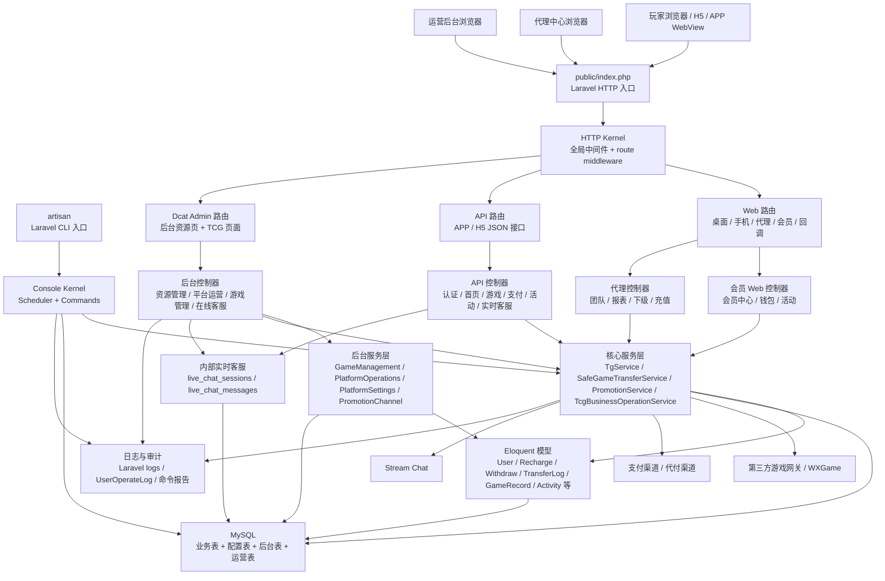
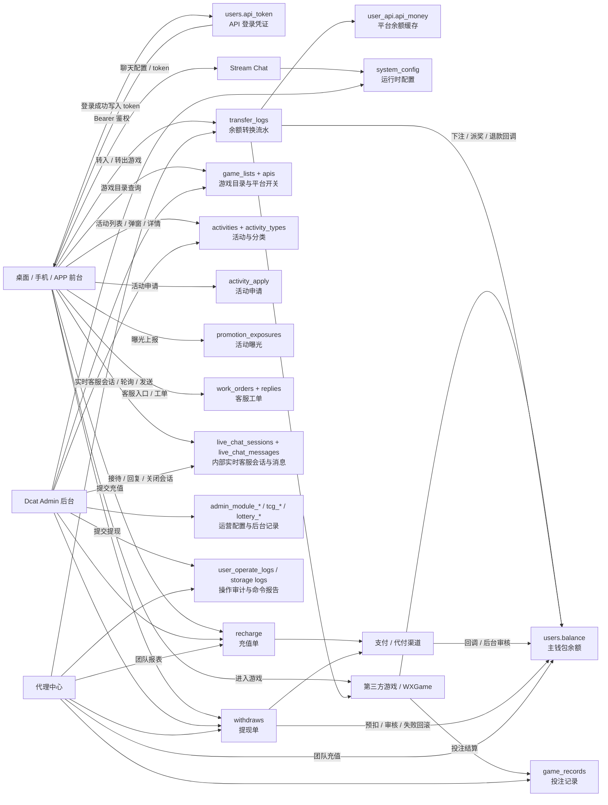
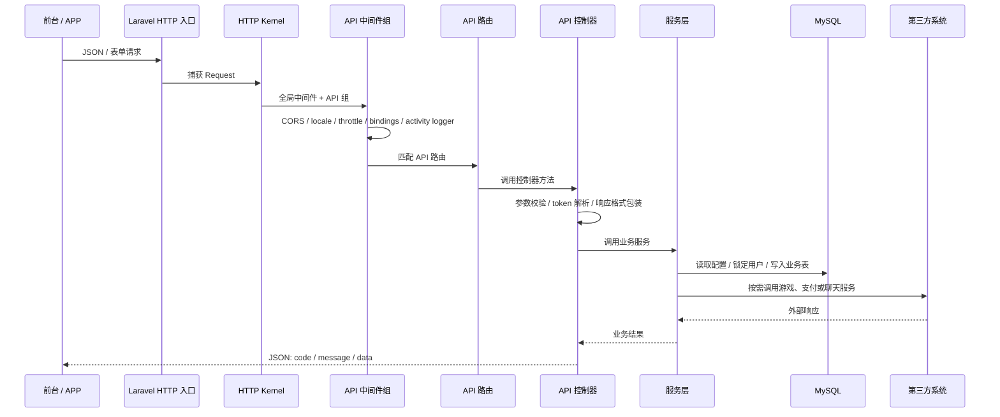
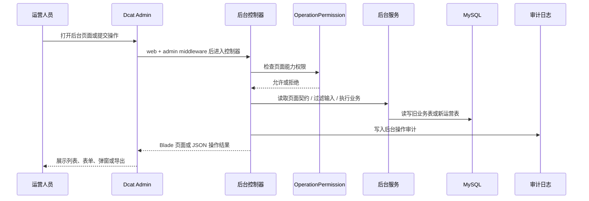
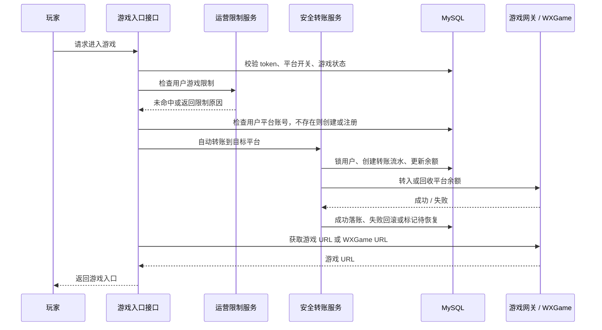

# TH2W / TH2.VIP 技术架构文档

## 1. 架构定位

本项目是一个 Laravel 6 单体应用。它不是纯 API 服务，也不是纯后台系统，而是在一个代码库中同时承载：

- 玩家桌面端页面
- 玩家手机端页面
- APP / H5 JSON API
- 代理中心
- Dcat Admin 运营后台
- 第三方游戏、支付、推广、客服、聊天和运营审计集成

系统的核心架构特征是：**Laravel 路由与控制器承接大量业务入口，关键资金和运营能力逐步下沉到服务层，后台运营能力通过 Dcat Admin 和 TCG 页面契约快速扩展。**

## 2. 仓库布局

### 根目录职责

| 区域 | 职责 |
|---|---|
| `app/` | Laravel 应用代码，包含 HTTP 控制器、Admin 控制器、模型、服务、命令、中间件和服务提供者 |
| `app/Admin/` | Dcat Admin 后台入口、资源控制器、自定义运营页面、后台服务和后台辅助类 |
| `app/Http/` | 玩家 API、Web 会员、代理、WAP、桌面端控制器和中间件 |
| `app/Services/` | 第三方游戏、支付、活动、安全转账、TCG 业务限制等跨控制器服务 |
| `app/Console/` | Artisan 命令和 Laravel Scheduler 任务 |
| `config/` | Laravel 配置、Dcat Admin 配置、游戏分类映射、支付默认配置 |
| `database/migrations/` | 传统业务表、Dcat Admin 表、新增运营表和活动扩展表 |
| `database/sql/` | Stream Chat 配置 SQL 脚本 |
| `docs/superpowers/` | 近期功能计划和设计文档，反映活动系统、游戏管理等演进方向 |
| `public/` | Web 入口、桌面/手机静态首页、前台运营脚本、活动脚本和客服页面 |
| `resources/views/` | Blade 视图，覆盖 Dcat 自定义页面、代理中心、Web 模板和少量 WAP 模板 |
| `routes/` | API、Web、console、broadcast 路由 |
| `tests/` | PHPUnit 测试，重点覆盖后台页面契约、迁移、服务、路由和前端源码入口 |
| `javaxiangmu-docs/` | 本次生成的工程语义文档 |

### 代码组织特点

项目同时存在三种组织方式：

1. Laravel 默认结构：Provider、Kernel、Controller、Middleware、Model、Migration。
2. Dcat Admin 结构：后台资源控制器、Repository、Actions、Forms、Metrics、Renderable、Blade 页面。
3. 自定义 TCG 运营结构：页面代码、页面契约、通用服务、通用 Blade 页面、权限常量和审计记录。

这三种方式并存，说明项目经历了从传统 Laravel 后台到更强运营后台的演进。

## 3. 系统架构图

图示说明：

- 所有 HTTP 请求先进入 Laravel HTTP Kernel，再根据路由组进入 Web、API 或后台控制器。
- 玩家和代理业务主要由控制器直接承接，关键的资金、游戏、活动和运营限制逻辑逐步抽到服务层。
- 后台 TCG 页面通过控制器 + 服务 + 通用 Blade 视图工作，服务层维护页面契约和输入过滤。
- CLI 命令不经过 HTTP 路由，直接通过 Console Kernel 调度业务服务、数据库和日志。

## 4. 启动路径

### HTTP 启动

一次 HTTP 请求的确认路径如下：

1. Web 服务器把请求交给 Laravel 入口。
2. 入口加载 Composer autoload。
3. `bootstrap/app.php` 创建 Laravel Application。
4. Application 绑定 HTTP Kernel、Console Kernel 和 Exception Handler。
5. HTTP Kernel 捕获请求并执行全局中间件。
6. RouteServiceProvider 加载 API 路由和 Web 路由。
7. Dcat Admin 自身加载 Admin 路由，项目在 Admin 路由组中追加后台业务路由。
8. 控制器执行，调用模型、服务、第三方接口和数据库。
9. 响应返回，Kernel 执行 terminate。

### CLI 启动

Artisan 命令的路径如下：

1. `artisan` 加载 Composer autoload 和 Laravel Application。
2. Application 解析 Console Kernel。
3. Console Kernel 注册命令并加载 `routes/console.php`。
4. Scheduler 定时触发抓取游戏记录、代理返佣和运营审计命令。
5. 命令直接读写数据库、调用服务，并把报告写入日志或指定输出目录。

### Dcat Admin 启动

后台入口使用 Dcat Admin：

- 后台路由前缀来自 `config/admin.php` 的 `admin.route.prefix`。
- 后台认证 guard 是 `admin`，用户模型是 Dcat Admin 的 Administrator。
- 后台权限开关启用，并绑定菜单、权限和角色。
- `app/Admin/bootstrap.php` 在后台 Navbar 注入告警视图，并关闭 Dcat 表单编辑、新建、查看确认提示和默认删除按钮。

## 5. 中间件与请求边界

### 全局中间件

HTTP Kernel 的全局中间件包括代理信任、维护模式、POST 大小校验、字符串 trim、空字符串转 null 和 `CrossHttp`。

`CrossHttp` 承担两个职责：

- 根据请求头 `Lang` 设置 Laravel locale。
- 为响应设置 CORS 头，允许 Origin、Content-Type、Cookie、CSRF、Authorization、Lang 等请求头。

### Web 组

Web 路由组包含：

- Cookie 加密
- Session 启动
- CSRF 校验
- 路由绑定
- 用户活动记录

Web 组适合浏览器会话、会员页面、代理页面和 Dcat Admin 页面。

### API 组

API 路由组包含：

- 极高阈值 throttle
- 路由绑定
- CORS / locale 中间件
- 用户活动记录

需要登录的 API 再显式叠加 `api_auth`。`api_auth` 从 Authorization Bearer token 中提取 token，根据 `users.api_token` 查找用户，并拒绝禁用、删除或黑名单用户。

### 后台权限

Dcat Admin 自身提供后台认证和权限。项目新增 `OperationPermission` 作为统一权限常量入口，后台平台运营、游戏管理等自定义页面在 JSON 操作中主动断言权限。

## 6. 控制器与模块职责

### API 控制器

| 模块 | 主要职责 |
|---|---|
| API 认证控制器 | 注册、登录、PC 登录、用户资料、余额、密码、支付密码、头像、注销 |
| API 首页 / 游戏控制器 | 首页内容、公告、活动旧接口、客服、工单、内部实时客服、游戏列表、游戏启动、WXGame 回调、投注和转账记录 |
| API 支付控制器 | 充值、提现、银行卡 / USDT / EBPay 资料、转账、一键回收、支付通道、红包、支付回调 |
| API 活动控制器 | 活动分类、活动列表、详情、弹窗、申请、曝光记录 |
| APP 控制器 | 面向旧 APP 接口的登录、支付列表、游戏、公告、活动、提现、充值记录等 |

### Web / 代理控制器

| 模块 | 主要职责 |
|---|---|
| Web 控制器 | 桌面首页、游戏分类入口、活动入口、文章、下载、静态页面转发 |
| WAP 控制器 | 手机端首页、会员中心、活动、钱包、游戏入口 |
| Member 控制器 | 会员中心、游戏、转账记录、返水、红包、活动、VIP 奖励、分享、财务报表 |
| Member 支付控制器 | Web 端充值、支付回调、提现、绑卡、一键回收、游戏平台余额 |
| Agent 控制器 | 代理首页、团队报表、下级、业绩、返点、邀请、团队充值、成员记录 |

### 后台控制器

后台控制器分两类：

- Dcat 资源控制器：用户、充值、提现、活动、游戏、支付、代理、文章、系统配置、日志等传统 CRUD 页面。
- 自定义 TCG 控制器：平台配置、平台运营、推广渠道、KYC、游戏管理、TCG shell、运营记录、积分商城、玩家运营、在线客服等。

## 7. 服务层职责

### `TgService`

`TgService` 是第三方游戏网关适配层。它从系统配置读取游戏 API 地址、商户账号和密钥，负责：

- 第三方平台注册
- 游戏登录 URL 获取
- 平台余额查询
- 转入游戏平台
- 从游戏平台转出
- 商户额度查询
- 游戏列表和游戏记录查询
- WXGame 请求签名、列表、登录、RTP 操作

### `SafeGameTransferService`

这是资金链路中最重要的服务。它封装主余额和第三方游戏平台余额之间的安全转账：

- 自动进入游戏时，先回收上一个平台余额，再把主余额转入目标平台。
- 手动转入游戏时，先锁用户、扣主余额、创建 pending 转账，再调用第三方 deposit。
- 第三方 deposit 失败时，回补主余额并标记外部失败。
- 第三方 deposit 成功时，标记转账成功并更新用户平台余额。
- 从游戏转回主余额时，先创建 pending 记录，第三方 withdrawal 成功后再增加主余额。
- 如果外部成功但本地落账异常，会写入本地待恢复状态，便于后续对账。

### `PromotionService`

活动服务负责纯粹的活动可见性判断：

- 活动总开关
- 手机渠道开关
- 开始时间和结束时间
- 排序
- 首页弹窗选择

控制器负责用户、申请、曝光和响应格式，服务负责业务筛选规则。

### `TcgBusinessOperationService`

该服务提供运营风控能力：

- 活动黑名单命中判断
- 活动券校验和使用
- 活动翻倍规则选择
- 用户游戏限制命中判断
- 玩家限额命中判断

它使用 `tcg_*` 业务运营表，并在活动申请、游戏启动、WXGame 下注和余额转账中被调用。翻倍规则当前已提供按活动、金额区间、有效期和倍率优先级选择规则的服务能力，但证据不足以说明所有奖励发放流程都已经接入。

### 后台服务

| 服务 | 职责 |
|---|---|
| GameManagementService | 定义游戏管理页面契约，处理游戏列表、热门游戏、彩票、免费转次数等页面的数据过滤、保存、状态和导入导出 |
| PlatformOperationsService | 定义平台运营页面契约，兼容配置型、记录型、交易型和旧表型页面 |
| PlatformSettingsService | 定义平台配置 tabs 和字段，过滤平台配置值和上传字段 |
| PromotionChannelService | 定义推广渠道页面、资料字段和配置字段 |
| KycSettingsService | 定义 KYC 字段、规则和前台内容配置 |
| SystemUserAlignmentService | 定义系统用户、IP、权限和任务相关校验 |

## 8. 数据流图

图示说明：

- `users.balance` 是主钱包余额，游戏、充值、提现、代理充值都围绕它变化。
- `transfer_logs` 是游戏余额转换、返水、代理佣金、团队充值等资金变化的重要审计表。
- `system_config` 是运行时配置中心，后台会把部分运营配置同时写入 `system_config` 和运营设置表。
- 前台 token 存在用户表中，前端脚本会把 token 保存在浏览器本地存储，用于后续 Bearer 鉴权。

## 9. 请求链路图

### API 请求链路

### 后台请求链路

### 游戏启动和转账链路

## 10. 存储模型

### 核心业务表

| 表 | 职责 |
|---|---|
| `users` | 玩家账号、主余额、VIP、状态、黑名单、代理上级、API token |
| `user_api` | 用户在第三方游戏平台下的账号和平台余额缓存 |
| `usersmoney` | 多平台余额缓存的旧模型表 |
| `recharge` | 充值订单，包含系统订单、商户订单、金额、手续费、实到金额、支付方式、状态 |
| `withdraws` | 提现订单，包含卡片、金额、手续费、实到金额、类型和状态 |
| `transfer_logs` | 钱包和游戏平台之间的转换流水，也承载返水、佣金、团队充值等资金变动记录 |
| `game_records` | 投注记录，包含用户、注单、平台、游戏类型、投注、有效投注、输赢和状态 |
| `apis` | 第三方游戏平台配置与启停状态 |
| `game_lists` | 游戏目录，包含平台、游戏名、分类、排序、热门、新上架、推荐、PC / 手机状态 |
| `activities` | 活动主体，包含传统活动字段和新增弹窗、有效期、图片、行动链接等字段 |
| `activity_types` | 活动分类，新增 `enname` 后可把后台中文分类和前台泰文分类分开 |
| `activity_apply` | 用户活动申请，新增唯一约束避免同一用户重复申请同一活动 |
| `promotion_exposures` | 活动弹窗或详情曝光记录 |
| `work_orders` / `work_order_replies` | 客服工单和回复 |
| `live_chat_sessions` / `live_chat_messages` | 内部实时客服会话、消息、访客标识、会员绑定、未读数和关闭状态 |
| `system_config` | 系统级 key-value 配置中心 |

### 后台与运营表

| 表 | 职责 |
|---|---|
| `admin_users` / `admin_roles` / `admin_permissions` / `admin_menu` | Dcat Admin 认证、角色、权限和菜单 |
| `admin_module_records` | 通用运营记录型页面存储 |
| `admin_module_settings` | 通用运营配置型页面存储，并与 `system_config` 协同 |
| `admin_module_transactions` | 通用运营交易型页面存储 |
| `platform_customer_services` | 客服链接配置 |
| `platform_app_builds` | APP 打包请求和下载链接记录 |
| `game_winner_rankings` | 游戏中奖排行 |
| `lottery_*` | 彩票分公司、开奖记录、彩种、玩法、销售监控、投注干扰等 |
| `free_spin_records` | 免费转次数记录 |
| `tcg_operational_records` | TCG 页面通用运营记录 |
| `tcg_activity_blacklists` | 活动黑名单 |
| `tcg_activity_coupons` | 活动券 |
| `tcg_activity_multiplier_rules` | 活动翻倍规则 |
| `tcg_point_rules` / `tcg_point_adjustments` / `tcg_point_mall_products` / `tcg_point_exchange_orders` / `tcg_point_reward_records` | 积分规则、积分调整、商城商品、兑换申请和积分奖励记录 |
| `tcg_operation_tags` / `tcg_otp_verification_records` / `tcg_player_level_histories` / `tcg_frontend_copy_settings` | 玩家运营标签、OTP 验证记录、等级历史和多语言前台文案设置 |
| `tcg_player_limit_rules` | 玩家限额规则 |
| `tcg_user_game_restrictions` | 用户游戏限制 |
| `user_operate_logs` | 用户和后台操作审计 |

### 数据模型特点

- 大多数业务模型使用 `$guarded = []`，快速但依赖控制器或服务做输入过滤。
- 部分新后台服务使用白名单过滤，降低批量赋值风险。
- `system_config` 使用 `key` 作为主键，不使用时间戳。
- 新增迁移大量使用 `Schema::hasTable` 和 `Schema::hasColumn`，强调生产兼容和重复执行安全。

## 11. 配置体系

### 环境配置

Laravel 标准配置从 `.env` 读取：

- 应用环境、URL、debug、APP_KEY
- 数据库连接
- Session 驱动
- 队列连接
- 后台域名和后台路径
- PC / WAP / Agent 相关域名

证据不足：仓库没有 `.env.example`，因此完整环境变量清单需要从代码调用处进一步整理。

### 文件配置

| 配置 | 职责 |
|---|---|
| `config/app.php` | Laravel 服务提供者、时区、locale、别名 |
| `config/auth.php` | Web 认证使用 `App\User`，API guard 也配置为 session，但项目实际 API 鉴权主要使用 Bearer token |
| `config/admin.php` | Dcat Admin 路由、认证、权限、菜单、上传、数据库表 |
| `config/database.php` | MySQL、Redis 等连接 |
| `config/queue.php` | 默认 sync 队列 |
| `config/logging.php` | 默认 daily 日志，保留 14 天 |
| `config/conf.php` | 游戏平台代码、游戏类型和名称映射、VIP 图标 |
| `config/pay.php` | CGPay 默认商户配置 fallback |
| `config/errorcode.php` | 多语言响应 code 文案 |

### 数据库配置

大量业务配置在 `system_config` 中维护。新后台页面会把部分配置写入 `system_config`，同时写入 `admin_module_settings` 作为页面级设置记录。

典型配置包括：

- 充值 / 提现上下限
- 提现时间窗口和手续费
- 游戏 API 地址和密钥
- WXGame API 域名、AccessKey、回调签名、币种
- 客服链接和 Stream Chat 配置
- 平台样式、下载链接、APP 打包配置

## 12. API / 外部边界

### 前台 JSON 接口边界

架构层面可归纳为以下语义接口：

- 【接口：用户注册与登录】
- 【接口：用户资料与余额】
- 【接口：游戏目录查询】
- 【接口：游戏启动】
- 【接口：游戏余额转入转出】
- 【接口：充值申请】
- 【接口：提现申请】
- 【接口：银行卡与虚拟币地址管理】
- 【接口：活动分类与活动列表】
- 【接口：活动详情与弹窗】
- 【接口：活动申请】
- 【接口：客服配置与工单】
- 【接口：实时客服会话】
- 【接口：实时客服消息轮询】
- 【接口：实时客服消息发送】
- 【接口：实时客服会话关闭】
- 【接口：代理团队报表】
- 【接口：代理团队充值】

这些接口由前台静态脚本、APP 或 H5 调用，返回统一的 `code / message / data` JSON 格式。

### 后台接口边界

后台接口主要由 Dcat Admin 页面触发：

- 【接口：后台资源 CRUD】
- 【接口：平台配置保存】
- 【接口：平台运营记录保存与导出】
- 【接口：游戏管理记录保存、状态、导入导出】
- 【接口：推广渠道资料维护】
- 【接口：KYC 配置维护】
- 【接口：TCG shell 像素配置与操作日志】
- 【接口：后台实时客服会话处理】

后台接口一般先做 Dcat admin 登录态校验，再做 `OperationPermission` 能力检查。

### 第三方边界

| 第三方 | 边界语义 |
|---|---|
| 第三方游戏聚合网关 | 注册游戏账号、登录、余额查询、转入、转出、游戏记录 |
| WXGame | 获取游戏 URL、游戏列表、RTP 设置、玩家校验、余额、下注、派奖、退款、状态 |
| 支付渠道 | 充值下单、回调通知、代付提现 |
| Stream Chat | 获取聊天配置、生成用户 token、创建频道 |
| 推广平台 | 像素、S2S、投放参数和事件回传配置，部分仍是后台配置语义和壳页面 |

## 13. 异常处理与响应模式

### 统一响应

大多数业务控制器继承基础控制器并使用 `returnMsg()` 返回 JSON：

- `code`：业务码
- `message`：显式消息或从 `config/errorcode.php` 按语言取默认文案
- `data`：业务数据

语言由请求头 `Lang` 决定，默认中文。

### Laravel 异常

Exception Handler 基本保留 Laravel 默认逻辑，没有自定义全局 JSON 异常格式。

### 参数校验

基础控制器重写了 `validate()`，校验失败时直接输出 JSON 并 `exit`。这能快速兼容旧接口，但会绕过 Laravel 标准异常流和测试钩子。

### 资金异常

资金链路的异常处理在新服务中更细：

- 外部转入失败时回滚本地预扣。
- 外部转出失败时标记失败，不增加主余额。
- 外部成功但本地落账失败时标记本地待恢复。
- 转账流水包含外部状态、恢复状态和对账备注字段。

## 14. 定时任务和运营审计

Console Kernel 明确调度：

- 每 5 分钟抓取游戏记录。
- 每分钟执行代理返佣，并避免重叠。
- 每小时执行游戏、前台、API、钱包和后台运营审计，并写入对应日志。

命令侧重点包括：

- 游戏目录和第三方游戏数据对账
- 前台入口、页面资源、游戏打开参数、客服入口和公共文件检查
- API 端点覆盖和第三方游戏目录确认流程
- 钱包表唯一索引、重复订单、schema 和资金链路源码 guard 检查
- 后台路由、控制器、只读页面、危险入口、权限标记检查

这说明项目已经把“运营系统质量”部分转为命令化审计，而不仅依赖人工巡检。

## 15. 测试策略

测试分布显示，项目目前重点测试以下类型：

- 迁移字段和表结构测试
- 后台页面契约测试
- 后台路由测试
- 后台服务行为测试
- 控制器行为测试
- 前台源码入口和脚本引用测试
- 活动服务和活动前后台源码测试
- 运营、支付、佣金、客服 payload、内部实时客服、WXGame 管理源码测试

测试更多是“结构约束 + 服务逻辑”的组合，较少看到完整浏览器端到端测试和真实第三方集成测试。

## 16. 扩展点

### 新增前台 API

推荐路径：

1. 在合适的 API 控制器或新控制器中定义语义清晰的方法。
2. 把高风险业务规则下沉到服务层。
3. 在路由中明确是否需要 `api_auth`。
4. 使用 `returnMsg()` 保持旧客户端兼容。
5. 添加源码结构测试或服务测试。

### 新增后台运营页面

推荐路径：

1. 在对应后台服务中定义页面 code、标题、存储表、筛选项、列、字段和动作。
2. 在后台控制器中新增显式方法和显式路由，放在 TCG 泛路由之前。
3. 使用 `OperationPermission` 定义读写删导出能力。
4. 使用通用 Blade 页面渲染。
5. 保存、状态、删除、导入导出动作写审计。

### 新增业务配置

如果是运行时配置，倾向写入 `system_config`。如果配置属于某个 TCG 页面，还应同步写入页面设置表，以保留页面维度和操作者上下文。

## 17. 工程约定

已确认的本地约定：

- API 响应使用业务 code，而不是只依赖 HTTP status。
- API token 存在用户表，Bearer token 是主要 APP/H5 鉴权方式。
- 后台页面代码大量使用数字 code 对齐 TCG 菜单。
- 新后台页面尽量显式路由，避免被泛路由吞掉。
- 生产兼容迁移经常检查表和字段是否已存在。
- 前台静态入口通过版本查询参数控制资源刷新。
- 资金类新增逻辑优先使用事务、行锁和流水状态。

## 18. 架构优缺点

### 优点

- 单体架构降低部署复杂度，所有业务共享用户、钱包、配置和后台能力。
- 业务覆盖完整，玩家、代理、后台运营、游戏、支付、活动形成闭环。
- 新资金服务体现了明确的一致性设计。
- 后台 TCG 页面契约提升了大量运营页面的交付速度。
- 运行时配置中心便于运营调整。
- 测试和命令审计对近期新增模块有明显约束。

### 缺点

- 控制器体量过大，业务边界和副作用不够局部化。
- 用户模型重复，增加类型、认证和查询语义混乱。
- 旧逻辑残留在新 return 之后，阅读成本高。
- 路由兼容层多，同一业务存在多个入口，审计复杂。
- 部分安全策略依赖前端 localStorage token 和宽松 CORS，需要持续审查。
- 部署和 CI 证据不足，工程交付链路不够透明。

## 19. 技术债务与改进机会

### 高优先级

- 统一用户模型边界，明确 `App\User` 和 `App\Models\User` 的职责或逐步合并。
- 把支付、游戏、活动和代理中的高风险规则继续从大控制器迁移到服务层。
- 为资金链路补充端到端场景测试，包括外部失败、本地失败、重复回调和并发请求。
- 梳理需要 `api_auth` 的 API，减少手动解析 token 的重复实现。
- 为 CORS、回调验签和支付回调建立安全审计清单。

### 中优先级

- 清理不可达旧代码，保留必要逻辑到迁移说明或测试中。
- 为 `system_config` 建立配置字典、类型、默认值和变更审计。
- 将后台页面契约拆出更清晰的模块文档，避免数字 code 只依赖代码阅读。
- 增加部署文档和环境变量清单。
- 统一 API 错误码和 HTTP status 使用策略。

### 低优先级

- 将前台静态脚本中重复 API 调用封装为稳定客户端层。
- 对大型 Blade 页面拆分局部模板。
- 为运营审计命令输出建立统一报告目录和保留策略。

## 20. 证据边界

已确认：

- Laravel 6 + Dcat Admin 单体架构
- API / Web / Admin / Console 四种入口
- MySQL 为默认数据库
- `system_config` 为核心运行时配置中心
- 主钱包、充值、提现、转账、游戏记录、活动、代理、工单等核心数据模型
- 内部实时客服会话和消息数据模型
- 安全转账服务和 TCG 运营限制服务存在，并被游戏/资金链路调用
- TCG 风格后台页面契约、权限和审计机制存在

合理推断：

- 当前业务主要面向在线游戏聚合平台运营。
- 近期主要工程投入在前台静态体验、活动系统、游戏管理、平台运营和 TCG 后台对标。

证据不足：

- 真实生产部署架构
- Web 服务器配置
- CI/CD 流程
- 第三方账号真实配置
- 线上队列和定时任务运行方式
- 所有后台传统资源控制器的完整业务细节
