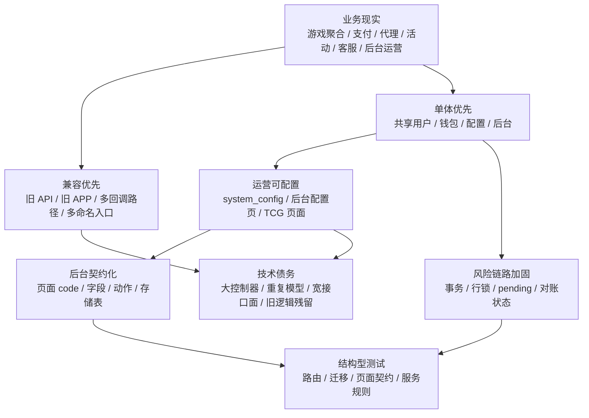

# TH2W / TH2.VIP 设计原因与工程思想

## 1. 文档定位

本文不是模块清单，也不是第二份技术架构文档的重复。本文尝试回答一个更重要的问题：

**为什么这个系统会长成现在这样？**

基于当前仓库证据，可以确认该项目的工程形态并不是单一架构风格，而是由多类现实约束共同塑造：

- 在线游戏业务需要同时处理玩家、代理、后台运营、游戏厂商、支付渠道和活动投放。
- 业务对兼容性要求较高，旧 APP、旧 H5、旧 Web、第三方回调和新前台入口需要并行存在。
- 资金链路风险高，近期代码明显开始从控制器直接处理，转向事务、行锁、转账流水和可恢复状态。
- 后台运营页面需求密集，项目选择用“页面契约 + 通用控制器 / 视图”的方式快速补齐大量 TCG 风格页面。
- 客服链路需要同时支持外部链接、工单、第三方聊天和本地实时会话，不能押注单一提供方。
- 项目处于持续演进状态：传统 Laravel 资源控制器、Dcat Admin、新增服务层、TCG shell、前台静态入口和运营审计命令同时存在。

因此，本项目体现的核心工程思想可以概括为：

> **以单体架构承接完整运营闭环；以兼容策略保护旧客户端；在高风险链路上逐步引入服务化、显式状态和审计；在后台运营侧用契约化方式换取页面交付速度；在客服和活动等运营触点上保留可配置 fallback。**

## 2. 设计哲学总览

这张图表达的是项目背后的取舍关系：

- 业务复杂度首先推动了单体聚合，而不是服务拆分。
- 旧系统兼容要求让路由和接口面持续膨胀。
- 运营后台需求推动了配置化和页面契约化。
- 资金风险推动了更严谨的服务层设计。
- 快速演进带来了控制器膨胀、模型重复、旧逻辑残留和配置边界模糊等债务。

## 3. 单体优先：把完整运营闭环放在一个系统内

### 设计体现

项目采用 Laravel 6 单体应用承载所有运行面：

- 玩家桌面端和手机端入口
- APP / H5 JSON API
- Web 会员中心
- 代理中心
- Dcat Admin 后台
- TCG 风格运营后台
- 内部实时客服
- 支付回调和游戏回调
- 定时任务与运营审计命令

这不是“简单单体”，而是一个面向运营闭环的业务单体。用户、钱包、充值、提现、游戏记录、代理、活动、后台配置和审计日志都在同一数据库和同一应用边界内协同。

### 为什么可能这样设计

合理推断，项目选择单体优先主要有三个原因：

1. **资金一致性更容易集中控制**

   游戏平台余额、主钱包余额、充值、提现、代理团队充值、返水和佣金都围绕用户余额变化。如果拆成多个服务，需要处理跨服务事务、分布式幂等、消息补偿和对账系统。当前项目仍处在 Laravel 6 + MySQL 单体阶段，用本地事务和行锁解决核心一致性问题更现实。

2. **运营后台需要直接读写大量业务表**

   Dcat Admin 和 TCG 后台页面直接操作用户、游戏、支付、活动、配置和运营表。单体架构让后台可以直接复用 Eloquent、DB facade、权限和文件上传能力，减少后台独立服务的成本。

3. **业务交付速度优先于架构纯度**

   代码中有大量新增运营迁移、页面契约、活动扩展和前台静态入口。它们更像在现有系统上快速补齐业务能力，而不是重建一个分层极度干净的新系统。

### 取舍评价

优点：

- 部署和联调复杂度低。
- 用户、钱包、配置、活动和后台之间共享上下文。
- 适合运营需求频繁变化的中小团队或过渡期项目。

代价：

- 控制器和模型容易吸收过多业务职责。
- API、Web、Admin、Console 的边界靠约定维持，不够强制。
- 高风险逻辑如果不主动服务化，容易被多个入口重复实现。

## 4. 兼容优先：不轻易破坏旧客户端和旧回调

### 设计体现

项目中能看到大量兼容性设计：

- 活动系统同时保留旧活动接口和新的 promotions 语义接口。
- 工单接口同时提供 work-orders、workorder、ticket 等多套命名入口。
- WXGame 回调同时支持 wxgame 和 notify 语义入口。
- APP 控制器保留大量旧 APP 专用接口。
- 支付、银行卡、充值、游戏列表等接口存在重复路由或旧命名。

这种设计说明项目面对的不是单一新客户端，而是多个历史前端和第三方回调方。

### 为什么可能这样设计

在线游戏和支付类系统通常不能随意打断客户端：

- 老 APP 可能无法强制升级。
- H5 入口可能被代理、落地页或投放渠道缓存。
- 第三方游戏和支付回调地址变更可能有审批或配置延迟。
- 运营活动链接可能已经投放，旧路径需要长期有效。

因此，项目采用“新增语义更清晰的新接口，同时保留旧接口”的方式迁移。

### 取舍评价

这是一种现实主义设计。

它牺牲了 API 表面的干净程度，但降低了业务切换风险。对于正在运营的资金和游戏系统，这种取舍通常比一次性重构更稳妥。

代价也很明显：

- 同一业务存在多入口，权限和鉴权边界更难审计。
- 控制器方法会为了兼容不同请求格式而变复杂。
- API 文档和测试必须明确“旧入口”和“推荐入口”，否则后续开发容易继续扩大混乱。

## 5. 高风险链路服务化：不是所有逻辑都服务化，而是先处理资金和运营规则

### 设计体现

项目并没有把所有业务都拆成 service / usecase。大量流程仍在控制器中完成。但是几个高风险或高复用模块已经下沉到服务层：

- 安全游戏转账服务负责主钱包与游戏平台余额转换。
- 第三方游戏服务负责游戏网关和 WXGame 请求。
- 活动服务负责活动可见性和弹窗选择。
- TCG 业务运营服务负责活动黑名单、活动券、活动翻倍规则选择、游戏限制和玩家限额。
- 后台平台运营、游戏管理、平台设置、推广渠道等服务负责页面契约和输入过滤。

这种服务化不是“追求分层形式”，而是围绕风险、复用和变化频率进行局部抽象。

### 资金链路的设计思想

安全转账服务体现了项目中最清晰的工程思想：

- 转入游戏平台前，先在本地事务中锁定用户余额。
- 余额不足直接拒绝。
- 扣减主余额后创建 pending 转账流水。
- 调用第三方 deposit。
- 外部失败时回补本地主余额，并把流水标记为外部失败。
- 外部成功但本地后处理失败时，标记为“外部成功、本地待恢复”。
- 转出游戏平台时，先创建 pending 流水，外部 withdrawal 成功后再增加主余额。
- 用户平台余额缓存单独更新，并用锁避免并发写入冲突。

这说明作者已经意识到：第三方接口调用和本地数据库事务不能简单包在同一个事务里。外部系统成功、本地失败是必须显式表达的状态，而不是捕获异常后简单返回失败。

### 为什么这是优秀工程思维

资金系统最怕的是“状态不可解释”。安全转账服务没有假设所有事情都会一次成功，而是主动设计了几类状态：

- pending
- calling
- success
- failed
- external_failed
- external_success_local_pending

这些状态让后续对账、人工处理和恢复任务成为可能。

这比“调用第三方成功后直接改余额”更接近生产系统思维。

### 代价和局限

这个服务化仍然是局部的：

- 控制器中仍有旧转账逻辑残留，虽然新 return 之后实际不可达，但会干扰阅读。
- 资金链路的完整恢复任务、对账后台和端到端测试还需要继续增强。
- 其他资金入口，例如充值审核、提现审核、代理团队充值、返水和佣金，仍需要持续检查是否达到同等级别的一致性设计。

## 6. 活动系统的工程思想：把“可见性”做成纯规则，把“申请”留给控制器协调

### 设计体现

活动服务只做几件事：

- 判断活动是否开启。
- 判断移动端是否可见。
- 判断开始和结束时间。
- 排序。
- 从可见活动中选择弹窗活动。

它没有直接处理登录态、申请记录、活动券、曝光落库或响应格式。

### 设计原因

这是一个较好的边界划分：

- 活动可见性是纯业务规则，适合做成可测试函数。
- 活动申请需要用户上下文、黑名单、券、唯一申请约束和落库，更适合由控制器协调多个服务。
- 曝光记录属于行为埋点，不应该污染活动可见性的核心规则。

### 取舍评价

这类抽象做得比较克制。它没有把活动系统过度抽象成复杂领域模型，而是先把最容易复用、最容易测试的部分拆出来。

这适合当前项目状态：旧活动接口、新 promotions 接口、前台弹窗、后台活动配置还在并存，过度建模反而可能阻碍迁移。

## 7. 后台契约化：用页面 code 承接大量运营页面

### 设计体现

TCG 风格后台的核心思想是“页面契约”：

- 每个页面有一个数字 code。
- 页面定义包含标题、模块、存储表、筛选项、列表列、表单字段、动作能力、搜索字段、状态字段和日期字段。
- 控制器根据页面 code 调用通用服务。
- 通用 Blade 页面根据契约渲染列表、筛选、表单和操作。
- 显式路由优先注册，最后才由泛路由兜底展示 shell 页面。

游戏管理服务和平台运营服务都采用了这种模式。

### 为什么可能这样设计

后台运营页面数量大、字段多、变化快。如果每个页面都写一套独立 Controller、Form、Grid、Repository 和 View，会出现大量重复代码。

页面契约化可以快速完成：

- 菜单对齐
- 页面标题
- 筛选项
- 列表列
- 表单字段
- 状态切换
- 导入导出
- 批量删除
- 权限检查

这是一种“配置驱动后台”的设计。

### 优点

- 批量交付能力强。
- 页面能力可被测试固定，例如 routes、page source、service、migration 等测试。
- 字段白名单和输入过滤比直接 `$request->all()` 更安全。
- 新增页面时只需要补页面定义和必要适配器。

### 代价

- 页面 code 和业务语义之间需要文档维护，否则数字 code 会成为隐性知识。
- 契约过大后，服务类会变成新的复杂中心。
- 真实业务页、旧表适配页、配置页、报表页混在一个服务里时，模式分支会快速增加。
- 如果没有严格测试，契约字段和数据库 schema 容易漂移。

### 判断

这不是传统领域驱动设计，而是典型运营系统的实用主义设计。它更重视“快速补齐后台能力”和“保证页面契约稳定”，而不是每个页面都有精致的对象模型。

在当前项目阶段，这个取舍是合理的。但随着页面继续增加，建议把页面契约按模块拆分，并为 code 建立独立字典文档。

## 8. 运行时配置中心：把运营变化从代码发布中释放出来

### 设计体现

项目大量使用 system_config 和后台配置页承载运行时配置：

- 游戏网关 API 地址、商户账号和密钥。
- WXGame API 域名、AccessKey、币种、回调签名开关、SSL 校验开关。
- 提现时间、提现上下限、手续费。
- 客服入口和 Stream Chat 配置。
- 平台维护、下载链接、APP 打包、前台样式。
- 代理政策、佣金设置、支付配置等部分运营参数。

### 为什么可能这样设计

运营系统的配置变化频率高于代码发布频率。把这些参数放入数据库，可以让后台人员在不发版的情况下调整：

- 支付渠道
- 客服链接
- 游戏开关
- 活动展示
- 提现风控
- APP 下载链接
- 推广参数

这符合在线运营平台的现实需求。

### 取舍评价

优点：

- 运营响应快。
- 多环境之间可以动态调整。
- 后台页面能直接管理配置。

风险：

- 配置缺少统一类型定义时，字符串、布尔、数字、JSON 容易混用。
- 配置变更如果没有强审计和回滚，可能直接影响资金、回调和游戏入口。
- 配置 key 分散在服务、控制器和后台页面中，后续排查困难。

建议后续补一份配置参考文档，把 system_config 的 key、类型、默认值、使用模块、风险等级和是否可热更新列清楚。

## 9. 显式权限与审计：后台正在从“资源页权限”走向“操作能力权限”

### 设计体现

项目一方面使用 Dcat Admin 的登录、角色和权限体系，另一方面新增了 OperationPermission 作为操作能力常量集合，覆盖：

- 财务审核
- 会员余额调整
- 代理佣金结算
- 活动审核
- 会员状态修改
- 游戏列表和平台开关
- API 平台维护
- 平台运营读写删导出
- 游戏管理读写删导出

后台操作也逐步写入用户操作日志或专门的运营记录。

### 设计原因

传统后台资源页权限通常是“能不能访问某个菜单或资源”。但运营系统里真正危险的是动作：

- 通过充值
- 拒绝提现
- 修改会员余额
- 切换游戏开关
- 修改支付账号
- 导出资金报表
- 删除运营记录

把这些危险动作抽成能力常量，是比单纯菜单权限更细的权限模型。

### 当前局限

权限常量已经出现，但并不代表所有旧后台动作都完全接入了统一权限断言。传统资源控制器仍需要逐个审计。

因此，当前状态更像是“新后台模块建立了更好的权限方向”，而不是“整个后台权限模型已经完全统一”。

## 10. 测试思想：偏结构约束，而不是完整端到端

### 设计体现

测试目录显示，当前测试重点集中在：

- 后台页面目录和页面契约。
- 后台路由。
- 迁移字段。
- 平台运营服务。
- 游戏管理服务。
- 活动服务和活动接口源码。
- 前台入口脚本引用。
- 客服、支付、会员财务、代理佣金、WXGame 管理等源码结构。

这说明项目的测试并不主要是“模拟一个玩家完整操作流程”，而是大量使用结构型测试约束近期新增模块。

### 为什么可能这样设计

对一个已有 Laravel 业务系统，尤其是大量控制器依赖真实数据库、配置、第三方接口和历史数据的项目，补完整集成测试成本很高。

结构型测试能快速保护以下内容：

- 某个路由必须存在。
- 某个菜单不能死链。
- 某个迁移必须包含字段。
- 某个服务必须支持页面 code。
- 某个前台入口必须引用正确脚本。
- 某个安全 guard 不能被删除。

这适合在快速改造期防止回归。

### 取舍评价

优点：

- 成本低。
- 对页面契约、路由和迁移非常有效。
- 能防止“改名 / 删除 / 漏注册”类回归。

不足：

- 不能充分证明真实业务流程在浏览器和数据库中完整可用。
- 不能替代资金并发、第三方失败、重复回调等集成测试。
- 容易过度绑定源码字符串，导致测试表达的是“代码还在”，而不是“行为正确”。

建议后续对资金链路、WXGame 回调、充值提现审核、活动申请和代理团队充值补充少量高价值集成测试。

## 11. Schema 兼容思想：迁移优先保护生产可重复执行

### 设计体现

近期迁移和服务中能看到较多兼容判断：

- 创建表前判断表是否存在。
- 增加字段前判断字段是否存在。
- 服务查询前判断表是否存在。
- 保存旧表前按实际存在字段过滤。
- TCG 运营服务在相关表不存在时直接返回无命中。

### 设计原因

这说明项目很可能面对以下现实：

- 不同环境数据库状态不完全一致。
- 部分迁移可能已经手动执行过。
- 历史表结构存在差异。
- 新后台需要兼容旧业务表。
- 开发者需要降低重复执行迁移或增量部署失败的风险。

### 取舍评价

这种方式有生产兼容价值，但也会带来一类隐性风险：

- 迁移失败可能被“表已存在 / 字段已存在”掩盖。
- 服务在表不存在时静默降级，可能让功能看起来正常但实际没有生效。
- 数据结构真相分散在迁移、服务判断和数据库当前状态之间。

更好的后续方向是保留兼容判断，同时增加环境自检命令，把缺失表、缺失字段、危险默认值明确报告出来。

## 12. 简单优先与灵活优先的分界

项目在不同区域体现了不同倾向。

### 偏简单的地方

- 前台使用静态 HTML、CSS、原生 JavaScript，而不是引入复杂前端构建链。
- API 响应统一使用 code / message / data，兼容旧客户端。
- 队列默认 sync，没有强依赖异步基础设施。
- Laravel 单体直接读写 MySQL，减少服务间通信。
- 活动可见性服务保持为简单数组 / 对象筛选规则。

这些地方体现的是“能运行、易部署、少依赖”的工程取向。

### 偏灵活的地方

- system_config 承载大量运行时配置。
- TCG 后台使用页面契约定义字段、动作和存储。
- 平台运营服务支持 settings、records、legacy、report、transactions 等多种模式。
- 游戏管理服务支持不同游戏/彩票/免费转页面的动态字段和动作。
- WXGame 配置支持回调签名、币种、SSL 校验等开关。

这些地方体现的是“运营可配置、后台可扩展”的工程取向。

### 关键判断

项目不是没有抽象，而是抽象集中在“运营变化快的区域”。它没有把所有控制器都抽象得很干净，却愿意为后台页面和资金链路投入更复杂的设计。

这说明作者的工程优先级大致是：

1. 业务不中断。
2. 资金不出错。
3. 后台能快速补齐。
4. 旧客户端继续可用。
5. 再逐步改善代码结构。

## 13. 做得好的抽象

### 安全转账服务

价值：

- 把资金链路从控制器中拆出。
- 用事务和行锁保护用户余额。
- 用 pending 和 recovery 状态表达外部系统不确定性。
- 为对账和恢复留下状态。

适合继续复用，并作为其他资金链路重构的参考。

### 活动可见性服务

价值：

- 把活动展示规则从控制器中抽出。
- 输入输出简单，易测试。
- 不污染申请、曝光和响应格式。

适合继续扩展，但要避免把申请、优惠券、黑名单全部塞入同一个类，导致边界变混。

### TCG 业务运营服务

价值：

- 将活动黑名单、活动券、游戏限制、玩家限额等横切规则集中。
- 支持按用户、用户名、活动、平台、游戏类型和游戏 code 匹配。
- 对表不存在的情况做兼容降级。

这是运营风控规则的合理承载点。

### 后台页面契约服务

价值：

- 用统一结构描述大量页面。
- 将字段白名单、输入过滤、状态规范化和导入导出统一处理。
- 降低新增后台页面的边际成本。

后续需要防止服务类过大，可按模块拆分契约。

### OperationPermission

价值：

- 用能力常量表达危险动作。
- 避免权限字符串散落在控制器中。
- 支持超级管理员旁路和 Dcat 权限检查。

后续可以继续把传统后台资源控制器中的高危动作迁移到能力权限。

## 14. 做得较弱或正在过渡的抽象

### 控制器承担过多业务

API 首页、支付、会员、代理等控制器仍然承担大量职责：

- 参数解析
- token 获取
- 业务校验
- 数据库查询和写入
- 第三方调用
- 响应格式组装
- 兼容旧请求

这会让局部修改的影响范围变大，也会让测试难以聚焦。

### 用户模型重复

系统同时存在多个用户模型概念，包括面向认证的用户模型和多个 App\Models 下的用户模型。它们都围绕 users 表工作，但职责没有完全清晰隔离。

这种重复会造成：

- 关系方法和属性认知不一致。
- 鉴权用户与业务用户类型混用。
- 新开发者容易选错模型。
- 后续重构风险提高。

### API 鉴权没有完全统一

api_auth 中间件已经提供 Bearer token 认证，并把用户放入 request attributes。但部分旧接口仍可能手动解析 Authorization 或使用不同方式获取用户。

这说明鉴权边界正在统一过程中，还没有完全收敛。

### 响应和校验方式偏旧

基础控制器通过 returnMsg 统一 code / message / data，这对旧客户端友好。但自定义 validate 在失败时直接输出 JSON 并退出，会绕过 Laravel 标准异常流。

这是一种快速兼容旧接口的做法，但对测试、异常处理和中间件收尾不够理想。

### 动态配置缺少强类型

system_config 很灵活，但如果没有配置字典，系统会逐渐依赖“约定 key”。当 key 数量增多时，问题会变成：

- 不知道哪个配置被哪个模块读取。
- 不知道值是字符串、数字、布尔还是 JSON。
- 不知道是否允许后台热更新。
- 不知道变更是否需要重启、清缓存或通知第三方。

## 15. 当前项目可能受到的现实约束

以下是基于代码结构的合理推断，不是仓库中直接声明的事实。

### 约束一：已有业务不能停

兼容旧 API、旧 APP、旧活动入口、旧支付和回调路径，说明系统必须保护既有用户和第三方对接。

### 约束二：后台对标需求强

大量 TCG 数字 code、菜单别名、shell 页面、平台运营、游戏管理、推广渠道、KYC、积分商城、玩家运营和业务运营表，说明近期需求可能是对标某个成熟后台产品或迁移到一套新的运营后台语义。

### 约束三：资金安全压力上升

转账流水增加 recovery 字段、唯一订单索引、钱包审计命令、安全转账服务，说明项目近期已经识别出资金一致性和对账风险。

### 约束四：团队需要在旧系统上快速迭代

前台静态入口、源码结构测试、兼容迁移、页面契约和通用后台服务，都说明团队倾向于在现有系统中增量加固，而不是推倒重来。

## 16. 偶然复杂度

项目中有些复杂度是业务必要复杂度，有些是偶然复杂度。

### 必要复杂度

- 第三方游戏转入转出和外部状态不确定性。
- 支付回调、提现审核和资金对账。
- 代理多层级团队统计。
- 活动可见期、渠道、申请、曝光、黑名单和活动券。
- 客服外链、工单、第三方聊天和内部实时会话的多模式组合。
- TCG 后台大量运营页面和权限动作。
- 旧客户端兼容和第三方回调兼容。

这些复杂度即使重写系统也仍然存在。

### 偶然复杂度

- 同一用户概念存在多个模型。
- 同一业务存在多套接口命名且没有清晰推荐入口标识。
- 控制器过大，多个职责混合。
- 新 return 后保留不可达旧代码。
- 配置 key 分散、缺少类型字典。
- 部分服务类同时承担太多页面模式。
- CORS、鉴权和回调安全策略分散在不同位置。

这些复杂度可以通过逐步重构降低。

## 17. 技术取舍清单

| 取舍 | 当前选择 | 获得的收益 | 付出的代价 |
|---|---|---|---|
| 架构形态 | Laravel 单体 | 部署简单、共享上下文、资金本地事务容易 | 模块边界弱、控制器容易膨胀 |
| 前端形态 | 静态页面 + 原生 JS | 无构建依赖、改造快、部署直接 | 状态管理和 API 客户端分散 |
| 后台框架 | Dcat Admin + 自定义 TCG 契约 | 快速交付后台页面 | 页面 code 和契约复杂度上升 |
| 配置方式 | system_config 动态配置 | 运营可热调整 | 类型、审计、回滚要求更高 |
| API 演进 | 新旧接口并存 | 兼容旧客户端 | 接口面膨胀、审计困难 |
| 鉴权方式 | users.api_token Bearer token | 实现简单、兼容 APP/H5 | token 生命周期、存储和统一中间件仍需加强 |
| 客服形态 | 外链、工单、Stream Chat、内部实时客服并存 | 配置灵活、第三方不可用时仍可服务 | provider 优先级、游客会话和限流治理更复杂 |
| 队列策略 | 默认 sync | 部署依赖少 | 异步任务能力有限 |
| 测试策略 | 结构型测试较多 | 快速防回归 | 行为完整性和并发场景不足 |
| 迁移策略 | hasTable / hasColumn 兼容 | 降低增量部署失败风险 | 可能掩盖环境漂移 |
| 资金一致性 | 新链路事务 + pending + 恢复状态 | 对账和恢复能力增强 | 需要更多后台恢复和集成测试 |

## 18. 对后续演进的工程建议

### 一、以资金链路为标准，继续服务化高风险业务

安全转账服务已经建立了较好的样板。后续可以按同样思想梳理：

- 充值审核
- 提现审核和拒绝回滚
- 代理团队充值
- 返水领取
- 红包领取
- 代理佣金结算
- WXGame 下注、派奖和退款

每条链路都应明确：

- 幂等键是什么。
- 哪些表会变更。
- 哪些步骤需要行锁。
- 外部成功本地失败如何表达。
- 本地成功外部失败如何处理。
- 人工恢复入口在哪里。
- 审计日志如何查询。

### 二、统一用户模型边界

建议明确一个面向认证和业务的主用户模型，其他模型逐步改成别名、Repository 或只读 DTO。至少需要文档化：

- 哪个模型用于 API 鉴权。
- 哪个模型用于后台展示。
- 哪个模型用于资金链路。
- 哪个模型用于代理层级和统计。

### 三、建立 API 入口分级

不建议立刻删除旧接口。更实际的方式是给接口分级：

- 推荐入口：新前台、新 APP、新后台应使用。
- 兼容入口：旧客户端保留，不新增功能。
- 公开受限入口：如内部实时客服游客会话，允许匿名使用，但必须限制用途、频率和输入。
- 回调入口：第三方配置使用，必须有验签和幂等。
- 待废弃入口：记录调用量后逐步移除。

这样既保留兼容性，也能减少继续扩散。

### 四、为 system_config 建立配置字典

每个 key 至少应记录：

- key 名称
- 中文含义
- 类型
- 默认值
- 使用模块
- 是否敏感
- 是否可后台修改
- 是否需要审计
- 错误配置的影响范围

这会显著降低运营配置风险。

### 五、把 TCG 页面契约拆成模块字典

随着页面增加，建议把页面契约拆为：

- 平台设置契约
- 平台资金契约
- 游戏管理契约
- 推广渠道契约
- KYC 契约
- 业务运营契约

同时维护 code 到业务名称的文档，避免数字 code 成为隐性依赖。

### 六、补充少量高价值集成测试

最值得优先补的不是全站端到端，而是以下场景：

- 转入游戏时第三方失败，本地余额回补。
- 转入游戏时第三方成功但本地落账异常，流水进入待恢复。
- WXGame 重复 bet / win / refund 回调的幂等。
- 活动申请重复提交和黑名单命中。
- 内部实时客服游客建会话、登录后绑定会员、后台回复和关闭会话。
- 代理团队充值重复 client_order_no。
- 提现拒绝后余额回滚。

这些测试数量不必多，但能覆盖系统最贵的错误。

## 19. 给新技术负责人的判断

如果接手这个项目，不应把它简单评价为“代码不够干净”或“架构落后”。更准确的判断是：

- 这是一个处在增量改造期的 Laravel 运营单体。
- 老系统兼容和新后台对标需求同时存在。
- 项目已经在关键资金和运营模块上开始出现更成熟的工程设计。
- 最大风险不是缺少功能，而是边界不清和接口面过宽。
- 后续治理应优先围绕资金、安全、用户模型、配置字典和后台契约文档展开。

最不建议的做法是大规模重写。更现实的路线是：

1. 固定现有行为。
2. 为高风险链路补集成测试。
3. 把控制器中的资金、鉴权和活动规则逐步下沉。
4. 清理不可达旧逻辑。
5. 建立配置字典和 API 分级。
6. 再考虑更大的架构拆分。

## 20. 证据边界

已确认事实来自当前仓库中的：

- Composer 依赖与 Laravel 配置。
- API、Web 和 Admin 路由。
- HTTP 中间件和认证中间件。
- 安全游戏转账服务。
- 活动服务。
- TCG 业务运营服务。
- 内部实时客服 API、后台控制器和前台页面。
- 后台平台运营、平台设置和游戏管理服务。
- 后台权限常量。
- 定时任务调度。
- 迁移文件和测试文件列表。
- 前两份项目总览与技术架构文档中已整理的源码证据。

合理推断包括：

- 项目近期在对标 TCG 后台能力。
- 系统必须长期兼容旧客户端和第三方回调。
- 团队更倾向在现有系统上增量加固，而不是重写。
- 资金安全和后台运营能力是近期工程投入重点。

证据不足的部分：

- 真实线上部署流程。
- 真实第三方账号和生产配置。
- 实际用户访问量和接口调用量。
- 团队组织结构和开发流程。
- 线上事故历史。
- 是否存在仓库外的监控、告警、队列 worker 或对账系统。
