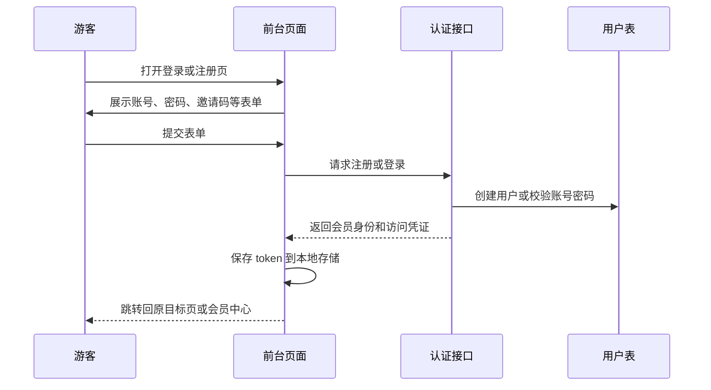
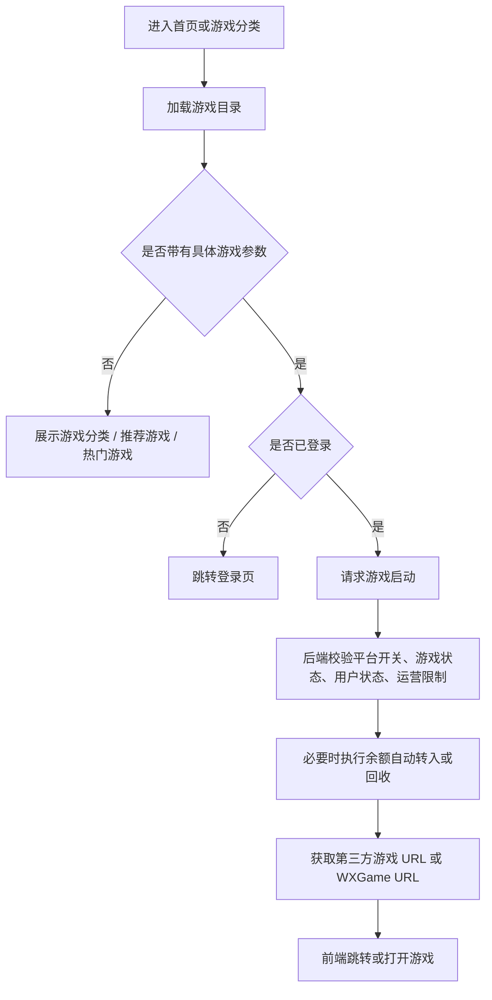
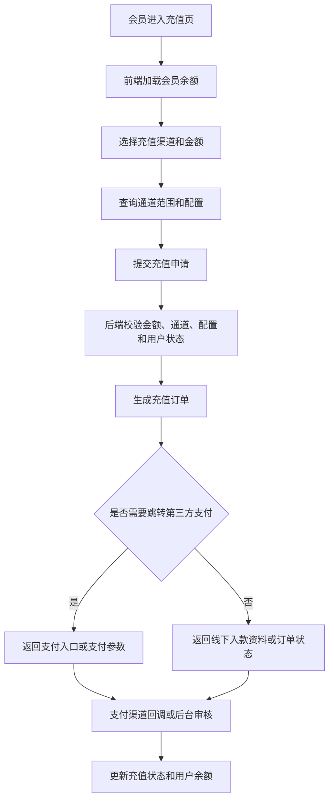
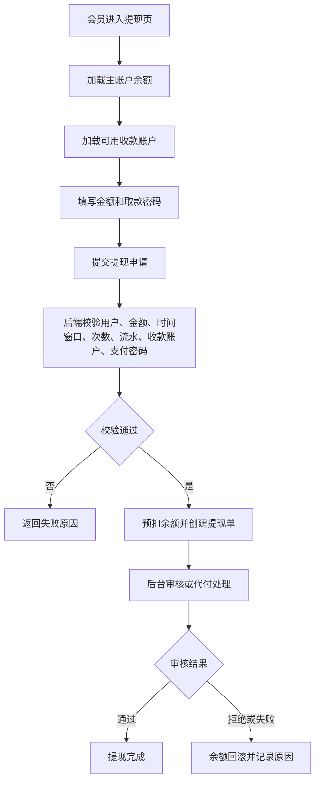
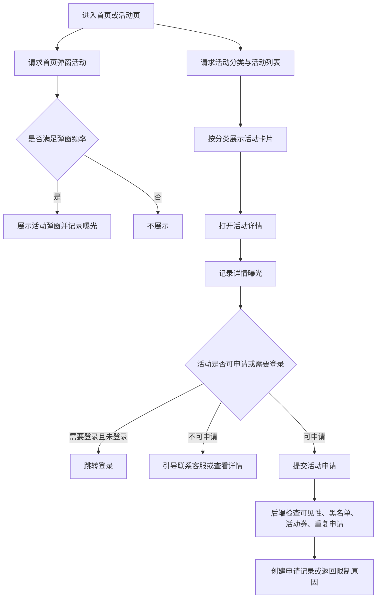
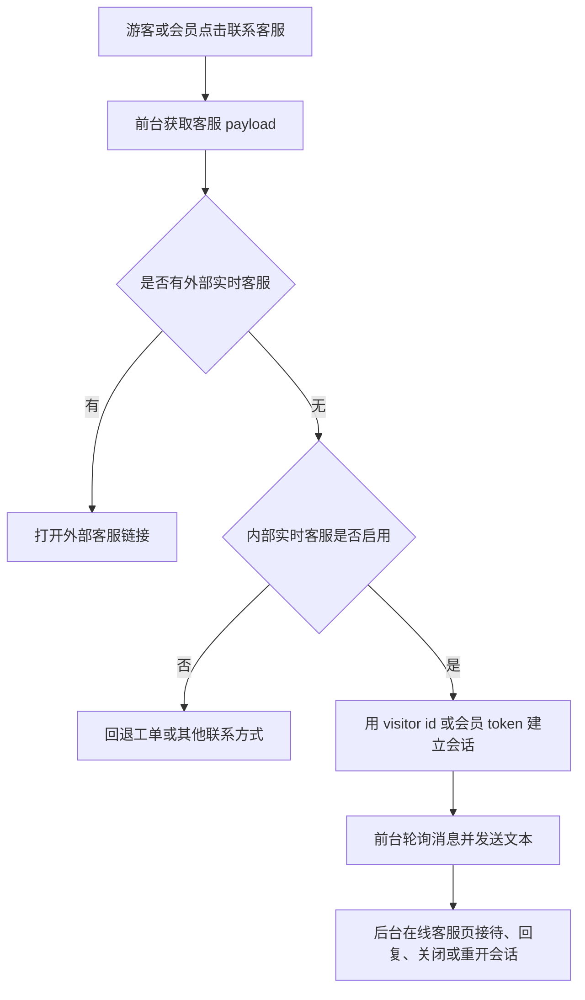

# TH2W / TH2.VIP 产品与交互分析

## 1. 产品定位

基于前台入口、API 控制器、活动系统、支付流程、游戏网关和后台运营模块，可以确认本项目是一个 **在线游戏聚合运营平台**。它不是单一游戏产品，而是围绕“玩家注册 → 浏览游戏 → 充值 → 进入第三方游戏 → 投注结算 → 提现 / 参加活动 → 客服支持”的完整运营链路构建。

前台品牌以 **TH2.VIP** 呈现，业务系统内部也使用 **TH2W** 命名。产品面向玩家、代理和后台运营人员三类主要角色，同时还与第三方游戏厂商、支付渠道、Stream Chat、内部实时客服、推广渠道和 TCG 风格运营后台能力对接。

从代码可推断的产品核心目标：

- 为玩家提供游戏大厅、会员中心、充值提现、活动福利和客服入口。
- 为代理提供团队成员、团队业绩、团队充值、佣金和下级管理。
- 为运营人员提供会员、资金、游戏、活动、支付、平台配置、推广渠道和风险控制后台。
- 为第三方游戏与支付系统提供稳定的回调和对接边界。

## 2. 用户角色

### 游客

游客可以访问首页、游戏分类页、活动列表、公告、客服入口和登录注册页。游客不能进入需要余额或账号上下文的操作，例如进入游戏、充值、提现、活动申请、工单提交和会员中心。

前台脚本会根据本地是否存在 API token 切换游客操作和会员入口。未登录访问会员或游戏启动流程时，会引导跳转到登录页，并保留 redirect 语义。

### 会员玩家

会员玩家是产品的核心用户。可见能力包括：

- 查看会员中心和账户余额。
- 进入游戏大厅。
- 启动第三方游戏或 WXGame 游戏。
- 发起充值。
- 提交提现。
- 管理银行卡、USDT、EBPay 等收款资料。
- 查看充值、提现、转账、投注、返水、消息等记录。
- 领取返水和红包。
- 申请活动。
- 创建和回复客服工单。
- 通过内部实时客服发起会话、发送消息并等待后台客服回复。
- 获取 Stream Chat 配置和聊天 token。

### 代理

代理角色基于用户上下级关系。代码显示代理可以：

- 查看团队报表。
- 查看下级列表。
- 新增成员。
- 设置代理或返点。
- 查询下级投注、充值、提现、盈亏。
- 发起团队充值。
- 查看邀请码、邀请列表和佣金列表。

代理团队充值是高风险能力，代码中已使用 `client_order_no` 幂等键、事务、行锁和双向转账流水。

### 后台运营人员

后台运营人员通过 Dcat Admin 和 TCG 风格页面处理：

- 会员管理、状态、余额、VIP、黑名单。
- 充值审核、提现审核、资金报表。
- 游戏平台、游戏列表、热门游戏、彩票配置。
- 活动分类、活动内容、活动申请、活动券和黑名单。
- 在线客服会话接待、消息回复、关闭和重新打开。
- 支付方式、支付账号、银行卡、USDT、EBPay。
- 平台配置、客服配置、下载链接、APP 打包、前台样式。
- 推广渠道、SEO、落地页、推送和事件。
- KYC 配置、系统用户、角色、IP 白名单和任务历史。
- 积分商城规则、积分调整、商品兑换、玩家标签、OTP 验证记录、等级历史和前台文案设置。
- 运营审计和操作日志。

后台能力分为传统 Dcat 资源页和新 TCG 页面契约两套体系。

### 第三方系统

第三方系统不是人类用户，但在产品链路中是关键参与方：

- 游戏聚合网关：注册、登录、余额、转入、转出、游戏记录。
- WXGame：玩家校验、余额、下注、派奖、退款、状态。
- 支付渠道：充值下单、充值回调、代付提现。
- Stream Chat：聊天配置、用户 token、频道。
- 内部实时客服：前台访客/会员会话、消息轮询和后台人工接待。
- 推广平台：像素、S2S、投放参数、事件回传配置。

## 3. 第一屏产品结构

桌面端首页和手机端入口都强调同一组产品信号：

- 品牌：TH2.VIP。
- 游戏分类：热门、电子、真人、捕鱼、体育、彩票。
- 会员动作：登录、注册、会员中心。
- 快捷资金入口：钱包、充值、提现。
- 活动入口：热门活动、新会员奖励、充值活动、邀请好友。
- 客服入口：浮动客服、联系方式、工单页面。
- 多语言：中文、泰语、英文、越南语、印尼语、马来语、高棉语、缅甸语。

移动端入口比桌面端更强调底部导航：

- 首页
- 活动
- 游戏
- 客服
- 会员

代码中存在移动端自动跳转逻辑：小屏访问非活动、非公告、非会员、非登录注册、非游戏启动页面时，会导向移动端入口。这说明产品希望在手机上优先呈现定制 H5 体验，而不是简单缩放桌面页。

## 4. 主要用户旅程

### 4.1 游客注册 / 登录旅程

交互特点：

- 前端会识别当前是登录还是注册模式。
- 注册表单包含邀请码字段，说明用户增长和代理邀请是产品闭环的一部分。
- 登录成功后，前端会把 token 写入多个本地存储键，以兼容不同旧脚本或旧客户端命名。
- 未登录访问游戏启动或会员中心时，会跳转登录并携带 redirect 信息。

产品风险：

- token 存在浏览器本地存储中，使用方便但需要防范 XSS 和设备共享风险。
- 多个 token key 兼容旧逻辑，短期有利，长期会增加清理和注销一致性成本。

### 4.2 游戏浏览与启动旅程

后端可见规则：

- 游戏平台必须启用。
- 游戏必须公开，并满足 PC / APP 可见状态。
- 用户必须存在且未禁用、未删除、未黑名单。
- TCG 运营限制服务可以阻止特定用户、平台、游戏类型或游戏 code。
- WXGame 模式下，会生成玩家 token，再由 WXGame 返回游戏 URL。
- 普通第三方网关模式下，通过游戏服务注册、登录和获取入口。

产品含义：

- 游戏大厅不是静态链接集合，而是受后台运营开关、平台状态、游戏状态和用户限制共同控制。
- 游戏启动前自动转账体现“主钱包进入游戏平台”的产品体验，减少用户手动转账步骤。

### 4.3 充值旅程

代码中可见的支付方式包括银行卡、支付宝、微信、USDT、EBPay、CGPay、ZGPay 等。充值相关配置来自系统配置和支付类型表，包括最小充值、最大充值、赠送比例、支付通道字段、商户配置和支付账号。

交互特点：

- 前台会默认展示金额输入和渠道选择。
- 提交成功后会刷新历史记录。
- 异常时引导联系客服。

产品风险：

- 充值成功路径可能由支付回调、后台审核或线下确认共同完成，需要严格保持订单幂等。
- 多支付渠道增加运营灵活性，也增加配置和回调验签风险。

### 4.4 提现旅程

前台文案提示“最低 100”“24H 内审核”“提现前会校验流水”，后端配置中也存在每日提现次数、最低提现、最高提现、提现时间窗口、打码量倍数、USDT 手续费和汇率等字段。

产品含义：

- 提现不是即时完成，而是申请 + 审核 / 代付流程。
- 提现前会校验流水和支付密码，说明平台控制套利和资金安全。
- 收款账户可能分银行卡、USDT、EBPay 等类型。

### 4.5 活动浏览、弹窗和申请旅程

活动系统的交互细节比较完整：

- 支持活动分类。
- 支持活动列表和活动详情。
- 支持首页弹窗。
- 支持 popup frequency：once、daily、always、session-like 行为。
- 支持弹窗延迟。
- 支持曝光记录。
- 支持登录后申请。
- 支持新接口申请失败后回退到旧活动申请接口。
- 支持活动直达 URL 和旧路径重写到 promotions 语义页。
- 支持后台中文管理名和前台泰文展示名分离，前台优先展示泰文标题、内容、规则和分类名。

产品含义：

- 活动系统不是静态 Banner，而是运营闭环：展示、曝光、详情、申请、审核和限制。
- 活动券、黑名单、用户限制等能力说明活动已经接入风控。
- 活动翻倍规则已进入后台运营表和规则选择服务，但当前证据不足以确认完整奖励发放闭环。

### 4.6 客服与工单旅程

客服能力有多种模式：

- 外部客服链接。
- Livechat / 实时客服链接。
- 内部实时客服。
- Stream Chat。
- 工单系统。
- 社交联系方式：Facebook、Telegram、WhatsApp、Instagram、Telegram Bot 等。

基础控制器会根据配置和玩家等级组合客服 payload：

- 如果配置了实时客服或 Stream Chat，模式倾向实时客服。
- 如果启用内部实时客服且没有更优先的外部实时客服链接，则前台会进入本地实时客服页。
- 如果配置 service_type 为工单，则返回工单页面和工单接口语义。
- 如果配置了平台客服列表，则按等级和位置排序返回多个联系方式。
- 如果没有可用配置，则进入无客服配置状态。

内部实时客服的产品旅程如下：

产品含义：

- 客服不是单一链接，而是可运营配置的服务矩阵。
- 平台支持按玩家等级展示不同客服入口。
- 工单接口提供创建、列表、详情、回复和关闭。
- 内部实时客服让平台在第三方 livechat 未配置时仍可提供即时咨询，但游客会话依赖 visitor id，天然比登录态接口更需要限流和滥用治理。

### 4.7 代理团队旅程

代理使用的核心旅程：

- 登录代理中心。
- 查看团队报表。
- 查询下级成员。
- 查看下级充值、提现、投注和盈亏。
- 添加成员或调整代理关系。
- 对下级发起团队充值。
- 查看佣金和邀请列表。

团队充值的产品规则更严格：

- 必须有代理身份和有效登录态。
- 必须指定下级会员。
- 金额必须有效。
- 调用方必须提供 client_order_no。
- 相同 client_order_no 重复提交时，成功订单会返回 duplicate 语义。
- 如果同一个 client_order_no 对应不同金额或不同会员，会拒绝。

这说明代理中心不只是报表页面，也承担资金操作。

## 5. 前后端协同方式

### 前台实现方式

前台不是现代 SPA 构建项目，而是静态 HTML + CSS + 原生 JavaScript：

- 桌面入口负责首页、导航、推荐游戏、活动入口、会员动作。
- 手机入口负责移动首页、底部导航和推荐游戏。
- home operations 脚本负责路由判断、登录注册、会员工具、游戏启动、充值提现、公告、客服浮层等。
- promotion system 脚本负责活动列表、详情、弹窗、曝光和申请。

这种方式的优势是部署简单、兼容旧 Laravel 静态资源路径。代价是状态管理、API 封装、页面切换和错误处理分散在脚本中。

### token 协同

前端从多个本地 key 中读取 token，并在请求时使用 Bearer 语义。后端 API 鉴权中间件按 token 查询用户表，并检查用户状态、删除状态和黑名单。

这体现了兼容旧前端的策略：前端保存多个 token key，后端也保留部分手动解析 token 的旧逻辑。

### 响应协同

后端多数业务返回 code / message / data 三段式响应。前端根据 code 是否为成功值判断交互分支，并兼容 data、url、game_url、login_url 等不同字段命名。

这说明前端对旧接口响应差异做了防御性兼容。

## 6. 业务规则汇总

### 登录与账号

- API token 是会员身份凭证。
- 禁用、删除或黑名单用户不能通过 API 鉴权。
- 注册支持邀请码。
- 会员中心要求登录。

### 游戏

- 游戏平台和单个游戏都可以后台启停。
- PC 和 APP 侧可见性可以分别控制。
- 游戏启动需要登录。
- 游戏启动会检查运营限制。
- WXGame 回调要求玩家 token 和可选签名校验。
- WXGame 下注、派奖、退款使用 transaction id 做幂等。

### 充值

- 充值金额受最小值、最大值和通道范围影响。
- 支付方式和商户配置可由后台维护。
- 充值成功可能来自第三方回调或后台审核。
- 充值记录会进入会员历史。

### 提现

- 提现要求登录、收款账户、取款密码和余额。
- 提现受时间窗口、每日次数、最低/最高金额、打码量和手续费影响。
- 提现通常进入后台审核。
- 失败或拒绝时需要余额回滚。

### 活动

- 活动必须启用。
- 移动端可见性可单独控制。
- 活动有开始和结束时间。
- 活动按排序和 id 倒序展示。
- 活动可以要求登录。
- 活动可以配置为可申请或只展示。
- 活动申请会检查黑名单、活动券和重复申请。
- 弹窗频率可按一次、每天、总是或会话控制。
- 前台活动展示优先使用泰文活动文案和泰文分类名，同时保留后台中文分类名用于运营识别。
- 活动翻倍规则按活动、金额区间、有效期和倍率优先级选择，但发放闭环仍需继续核对。

### 客服

- 客服入口由配置决定。
- 支持多联系方式。
- 支持按玩家等级过滤客服项。
- 支持工单和实时聊天两种方向。
- 内部实时客服由运行时开关控制，游客需要 visitor id，会员可通过 token 绑定会话。
- 客服 payload 会区分外部实时客服、内部实时客服、工单 fallback 和服务列表。

### 代理

- 团队统计按下级关系计算。
- 代理团队充值必须具备幂等号。
- 团队充值会同时影响代理余额、下级余额、充值记录和转账流水。

## 7. 运营逻辑

代码中可见的运营逻辑很强，主要体现在：

- 活动曝光记录：用于衡量活动展示和点击效果。
- 首页弹窗频率：避免反复打扰用户，同时支持强制预览。
- 游戏热门、新上架、推荐、排序：后台可影响前台游戏展示。
- 平台维护和下载配置：后台可控制前台状态、APP 下载入口和素材。
- 多语言切换：前端保存语言偏好，后端通过 Lang 头设置 locale。
- 客服配置：按平台服务、社交链接、实时聊天和工单做组合。
- 推广渠道：后台存在 SEO、落地页、推送、事件、像素和 S2S 配置语义。
- TCG 业务运营表：活动黑名单、活动券、玩家限额、用户游戏限制。
- 运营审计命令：定时检查前台、API、游戏、钱包和后台状态。

## 8. 边界情况

### 未登录访问

会员页、游戏启动、活动申请等需要登录的动作会引导登录。活动详情和列表则允许游客查看。

### 游戏启动失败

可能失败的原因包括：

- token 无效。
- 用户被禁用、删除或黑名单。
- 平台关闭。
- 游戏关闭。
- 命中游戏限制。
- 平台余额回收失败。
- 第三方游戏返回失败。
- WXGame 未配置完整。

### 充值失败

可能失败的原因包括：

- 金额低于或高于配置范围。
- 支付通道关闭。
- 商户配置缺失。
- 第三方支付创建订单失败。
- 回调验签或订单状态异常。

### 提现失败

可能失败的原因包括：

- 提现金额不合法。
- 不在提现时间。
- 超出每日次数。
- 余额不足。
- 打码量不足。
- 收款账户缺失。
- 取款密码错误。
- 后台审核拒绝或代付失败。

### 活动申请失败

可能失败的原因包括：

- 活动未启用。
- 当前渠道不可见。
- 不在活动时间。
- 用户未登录。
- 活动不允许申请。
- 已申请过。
- 命中活动黑名单。
- 活动券无效或过期。

### 客服不可用

如果外部客服链接、内部实时客服、Stream Chat 和工单开关都未配置，则客服 payload 会返回未配置状态。前端仍有默认工单页面 fallback。若内部实时客服开关开启但数据表未迁移完成，实时会话接口会进入不可用状态，需要先完成迁移和配置检查。

## 9. 产品优势

- 玩家旅程完整：从首页到游戏、资金、活动和客服都有闭环。
- 移动端和桌面端都存在独立入口。
- 活动系统具备运营指标和申请闭环。
- 客服入口多模式，适合不同运营阶段。
- 内部实时客服减少对第三方客服链接的依赖，并把会话、消息和未读数留在本地数据库。
- 后台运营能力覆盖广，尤其是 TCG 风格页面扩展快。
- 代理中心不仅有报表，也支持团队充值。

## 10. 产品风险

- 前台兼容逻辑很多，旧 token key、旧活动接口、旧路径和新页面并存，后续需要明确推荐入口。
- 提现、游戏启动、活动申请等高风险流程依赖多个配置项，错误配置会直接影响用户体验。
- 前台是静态脚本组织，复杂度继续增加后会变难维护。
- 多语言目前前端有较多本地文案，后端错误码也有语言配置，翻译一致性需要管理。
- 活动本地化已经把后台名和前台名分离，但历史活动数据仍需要持续校验，避免后台中文名被误展示到前台。
- 内部实时客服游客入口不依赖登录态，需要额外关注刷消息、伪造 visitor id 和客服消息内容治理。
- 游戏、支付、客服、活动、代理都依赖后台配置，缺少配置字典会给运营排错带来成本。

## 11. 证据边界

已确认：

- 产品有桌面入口和手机入口。
- 前端包含登录、注册、会员中心、游戏大厅、充值、提现、活动、公告、客服和多语言交互。
- 后端存在用户、游戏、支付、活动、代理、客服和后台运营能力。
- 活动系统支持分类、列表、详情、弹窗、曝光和申请。
- 客服支持外链、平台客服列表、Stream Chat、工单和内部实时客服。
- 代理团队充值有幂等和流水。

合理推断：

- 产品主要面向在线游戏运营市场。
- 活动和游戏展示承担拉新、留存和转化职责。
- TCG 后台能力来自对标或迁移需求。

证据不足：

- 实际线上 UI 运行效果。
- 真实投放渠道和活动转化数据。
- 用户画像、地区和合规策略。
- APP 原生端是否存在仓库外实现。
