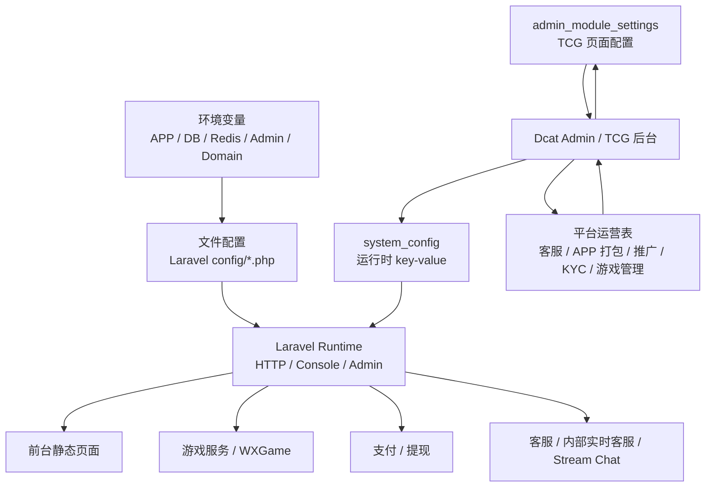

# TH2W / TH2.VIP 配置参考

## 1. 文档定位

本项目的配置体系较复杂，值得单独成文。系统配置分为三层：

1. **环境变量配置**：Laravel 运行环境、数据库、Redis、队列、后台路径、域名等。
2. **文件配置**：Laravel、Dcat Admin、数据库、队列、日志、支付默认值和游戏映射。
3. **数据库运行时配置**：`system_config` 和新后台配置表，承载游戏网关、WXGame、提现、充值、客服、内部实时客服、活动、APP、前台样式、推广和平台运营配置。

核心判断：

> 这个系统的真正运营开关主要不在配置文件，而在数据库配置和后台页面中。

## 2. 配置总览图

## 3. 环境变量配置

以下环境变量来自 Laravel 配置和控制器调用证据。仓库没有 `.env.example`，因此这里是从代码反推的配置清单，不代表完整生产清单。

### 应用基础

| 配置 | 作用 | 风险 |
|---|---|---|
| `APP_NAME` | Laravel 应用名，也影响 Redis prefix 默认值 | 低 |
| `APP_ENV` | 运行环境，默认 production | 中 |
| `APP_DEBUG` | 是否展示详细错误 | 高，生产必须关闭 |
| `APP_URL` | 应用公开 URL，用于生成客服、回调和公共链接 | 高 |
| `APP_KEY` | Laravel 加密 key，WXGame token secret 也可能回退使用它 | 高 |
| `ASSET_URL` | Laravel asset URL | 中 |

### 数据库

| 配置 | 作用 | 风险 |
|---|---|---|
| `DB_CONNECTION` | 默认数据库连接，默认 mysql | 高 |
| `DB_HOST` | 数据库地址 | 高 |
| `DB_PORT` | 数据库端口，默认 3306 | 中 |
| `DB_DATABASE` | 数据库名 | 高 |
| `DB_USERNAME` | 数据库账号 | 高 |
| `DB_PASSWORD` | 数据库密码 | 高 |
| `DB_SOCKET` | MySQL socket | 中 |
| `DATABASE_URL` | 数据库 URL 连接方式 | 高 |
| `MYSQL_ATTR_SSL_CA` | MySQL SSL CA | 中 |

### Redis

| 配置 | 作用 | 风险 |
|---|---|---|
| `REDIS_CLIENT` | Redis 客户端，默认 phpredis | 中 |
| `REDIS_HOST` | Redis 地址 | 中 |
| `REDIS_PORT` | Redis 端口 | 中 |
| `REDIS_PASSWORD` | Redis 密码 | 高 |
| `REDIS_DB` | Redis 默认 DB | 中 |
| `REDIS_CACHE_DB` | Redis cache DB | 中 |
| `REDIS_PREFIX` | Redis key 前缀 | 中 |
| `REDIS_CLUSTER` | Redis 集群配置 | 中 |

### 队列

| 配置 | 作用 | 风险 |
|---|---|---|
| `QUEUE_CONNECTION` | 队列连接，默认 sync | 中 |
| `QUEUE_FAILED_DRIVER` | 失败任务记录方式 | 中 |
| `REDIS_QUEUE` | Redis 队列名 | 中 |
| `AWS_ACCESS_KEY_ID` | SQS key | 高 |
| `AWS_SECRET_ACCESS_KEY` | SQS secret | 高 |
| `SQS_PREFIX` | SQS prefix | 中 |
| `SQS_QUEUE` | SQS queue | 中 |
| `AWS_DEFAULT_REGION` | SQS region | 中 |

当前证据显示默认队列是 `sync`。如果生产改用 Redis 或 database queue，需要额外配置 worker 进程；仓库内没有看到 worker 管理配置。

### Dcat Admin

| 配置 | 作用 | 风险 |
|---|---|---|
| `ADMIN_ROUTE_DOMAIN` | 后台绑定域名 | 高 |
| `ADMIN_ROUTE_PREFIX` | 后台路径前缀，默认 admin | 高 |
| `ADMIN_ASSETS_SERVER` | 后台资源域名 | 中 |
| `ADMIN_HTTPS` | 后台是否使用 HTTPS | 高 |

后台认证使用 Dcat Admin 的 admin guard、admin_users 表、admin_roles、admin_permissions、admin_menu 等表。

### 前台与代理域名

代码中可见以下域名变量被用于 URL 生成和路由分组：

| 配置 | 作用 | 风险 |
|---|---|---|
| `PC_URL` | PC 前台公开 URL 或域名 | 高 |
| `WAP_URL` | 手机端公开 URL 或域名 | 高 |
| `AGENT_URL` | 代理中心 URL 或域名 | 高 |
| `AGENT_LOGIN` | 代理登录 URL | 高 |
| `KF_URL` | 客服 URL 候选 | 中 |
| `SERVICE_URL` | 客服 URL 候选 | 中 |

这些变量会影响注册邀请、代理登录、客服 fallback 和前台跳转。

### 日志

| 配置 | 作用 | 风险 |
|---|---|---|
| `LOG_CHANNEL` | 默认日志通道，默认 stack | 中 |
| `LOG_SLACK_WEBHOOK_URL` | Slack 通知 | 高 |
| `PAPERTRAIL_URL` | Papertrail host | 中 |
| `PAPERTRAIL_PORT` | Papertrail port | 中 |
| `LOG_STDERR_FORMATTER` | stderr formatter | 低 |

文件配置中默认使用 daily 日志，保留 14 天。

## 4. 文件配置

### `config/app.php`

关键点：

- 时区固定为 `Asia/Shanghai`。
- 默认 locale 为 `zh_CN`。
- fallback locale 为 `en`。
- 注册 Laravel 基础 Provider。
- 注册二维码服务 Provider。
- `APP_KEY` 是加密核心，不能缺失。

风险：

- 如果 `APP_DEBUG` 在生产开启，会暴露异常和路径。
- 如果 `APP_KEY` 变更，Laravel 加密数据和部分 token fallback 语义会受影响。

### `config/auth.php`

关键点：

- 默认 guard 是 web。
- web guard 使用 session。
- api guard 也配置为 session。
- 用户 provider 使用 `App\User`。

实际运行含义：

- 玩家 API 并不主要依赖 Laravel 原生 api guard，而是通过自定义 Bearer token 中间件按 `users.api_token` 查询。
- 这会造成配置语义和真实 API 鉴权方式不完全一致。

### `config/admin.php`

关键点：

- 后台路由前缀来自 `ADMIN_ROUTE_PREFIX`，默认 `admin`。
- 后台 guard 为 `admin`。
- 后台权限开关开启。
- 菜单与权限绑定开启。
- 上传磁盘使用 `public`。
- 后台用户、角色、权限、菜单表使用 Dcat Admin 默认表。

风险：

- 后台 prefix 和域名属于高敏感配置。
- 权限开关如果关闭，`OperationPermission` 会直接放行。
- 上传目录和公开磁盘需要配合 Web 服务器权限控制。

### `config/database.php`

关键点：

- 默认数据库连接来自 `DB_CONNECTION`，默认 mysql。
- MySQL 使用 `utf8mb4_unicode_ci`。
- MySQL strict 模式开启。
- Redis 默认客户端是 phpredis。

风险：

- 资金、游戏、活动和后台表都依赖同一数据库，备份和迁移风险高。
- strict 模式开启后，历史数据不规范时迁移或写入可能失败。

### `config/queue.php`

关键点：

- 默认 queue connection 是 `sync`。
- 保留 database、beanstalkd、sqs、redis 配置。
- failed jobs 默认记录到数据库。

运行含义：

- 当前证据显示系统不强依赖异步队列 worker。
- 定时任务通过 Laravel Scheduler 运行，而不是队列定时消费。

### `config/logging.php`

关键点：

- 默认 channel 是 stack。
- stack 包含 daily。
- daily 日志路径是 Laravel 标准日志文件，保留 14 天。

项目还通过调度器把专项审计输出追加到多个日志文件：

- 代理返佣日志。
- 游戏运营审计日志。
- 前台运营审计日志。
- API 运营审计日志。
- 钱包运营审计日志。
- 后台运营审计日志。

### `config/conf.php`

关键点：

- 定义大量第三方平台 code。
- 定义游戏类型映射：真人、老虎机、彩票、体育、电竞、捕鱼、棋牌。
- 定义平台名称映射。
- 定义 VIP 图标映射。

用途：

- 游戏展示、报表、后台选项和老页面显示。

风险：

- 平台名称映射如果与数据库平台 code 不一致，会影响展示和统计。

### `config/pay.php`

关键点：

- 提供 CGPay 默认商户号、密钥和创建订单地址。

运行含义：

- 支付类型表中的商户配置可能覆盖或补充文件默认配置。

风险：

- 文件里不能保留真实生产密钥。
- 多支付渠道应优先使用后台配置和密钥脱敏审计。

## 5. `system_config` 运行时配置

### 存储模型

`system_config` 使用 key 作为主键，value 保存配置值，不使用时间戳。系统通过 `SystemConfig::getValue(key)` 读取，后台表单通过 update-or-create 写入。

优点：

- 简单。
- 便于后台动态修改。
- 无需发版即可调整运营参数。

风险：

- value 没有强类型。
- 缺少统一默认值。
- 缺少配置所属模块和风险等级。
- 某些 key 是敏感信息，需要脱敏审计。

### 站点与前台配置

| key | 作用 | 风险 |
|---|---|---|
| `site_name` | 网站名称 | 低 |
| `site_logo` | 网站 Logo | 中 |
| `app_logo` | APP 图标 | 中 |
| `site_title` | 网站标题 | 低 |
| `site_keyword` | 网站关键词 | 低 |
| `site_state` | 网站状态 | 高 |
| `repair_tips` | 维护提示 | 中 |
| `safe_domain` | 安全域名白名单 | 高 |
| `official_domain` | 前台展示域名 | 中 |
| `navigation_domains` | 导航备用域名 | 中 |
| `asset_domain` | 前端素材域名 | 中 |
| `download_bar_icon` | 下载条图标 | 低 |
| `login_bonus_img` | 登录页活动图 | 低 |
| `vip_rule_title_img` | VIP 规则标题图 | 低 |
| `isclose` | 首页弹窗开关 | 中 |
| `webcontent` | 首页弹窗内容 | 中 |

### APP 配置

| key | 作用 | 风险 |
|---|---|---|
| `android_version` | 安卓版本号 | 中 |
| `android_download_url` | 安卓下载地址 | 高 |
| `android_download_qrcode` | 安卓下载二维码 | 中 |
| `ios_version` | iOS 版本号 | 中 |
| `ios_download_url` | iOS 或分发下载地址 | 高 |
| `ios_download_qrcode` | iOS 下载二维码 | 中 |

TCG 平台设置还包含 APP 打包、图标、启动页、包名后缀、Google/Facebook/Appsflyer/Adjust 等配置语义。

### 游戏网关配置

| key | 作用 | 风险 |
|---|---|---|
| `game_api` | 第三方游戏 API 地址 | 高 |
| `merchant_account` | 游戏商户账号 | 高 |
| `api_secret` | 游戏商户密钥 | 高 |

使用模块：

- 第三方游戏服务。
- 后台站点设置。
- 部分后台首页状态展示。

要求：

- `api_secret` 必须脱敏审计。
- 修改后应验证注册、登录、余额、转入、转出和记录抓取。

### WXGame 配置

| key | 作用 | 风险 |
|---|---|---|
| `wxgame_enabled` | 是否启用 WXGame | 高 |
| `wxgame_api_domain` | WXGame API 域名 | 高 |
| `wxgame_access_key_id` | AccessKeyId | 高 |
| `wxgame_access_key_secret` | AccessKeySecret | 高 |
| `wxgame_app_id` | App ID | 中 |
| `wxgame_callback_domain` | 回调地址前缀 | 高 |
| `wxgame_currency` | 币种 | 高 |
| `wxgame_token_secret` | 玩家 token 密钥 | 高 |
| `wxgame_callback_signature_required` | 回调签名校验开关 | 高 |
| `wxgame_callback_sign_window` | 回调签名时间窗口 | 中 |
| `wxgame_ssl_verify` | 请求 SSL 校验 | 高 |

关键规则：

- WXGame 启用要求 API 域名、AccessKeyId 和 AccessKeySecret 完整。
- 回调签名可配置是否强制，但生产环境应启用。
- 币种不匹配会被拒绝。
- nonce 和 timestamp 用于重复回调签名保护。

### 充值配置

| key | 作用 | 风险 |
|---|---|---|
| `min_recharge_money` | 最低充值金额 | 高 |
| `max_recharge_money` | 最高充值金额 | 高 |
| `recharge_fee` | 充值赠送比例 | 中 |
| `usdt_rate` | USDT 汇率 | 高 |
| `min_price` | 银行卡最低充值金额 | 高 |
| `max_price` | 银行卡最高充值金额 | 高 |
| `onlinepay_title` | 在线支付标题 | 低 |
| `onlinepay_des` | 在线支付说明 | 低 |
| `companypay_title` | 公司入款标题 | 低 |
| `companypay_des` | 公司入款说明 | 低 |

风险：

- 金额上下限错误会直接影响充值可用性。
- 汇率错误会影响 USDT 资金计算。

### 提现配置

| key | 作用 | 风险 |
|---|---|---|
| `withdraw_begin_time` | 提现开始时间 | 高 |
| `withdraw_end_time` | 提现结束时间 | 高 |
| `daily_withdraw_times` | 每日提现次数 | 高 |
| `min_withdraw_money` | 最低提现金额 | 高 |
| `max_withdraw_money` | 最高提现金额 | 高 |
| `withdraw_fee` | 打码量倍数 | 高 |
| `withdraw_cash_fee` | USDT-TRC20 手续费 | 高 |
| `withdraw_fee_usdt_erc` | USDT-ERC20 手续费 | 高 |
| `withdraw_usdt_rate` | 提现 USDT 汇率 | 高 |
| `min_fanshui_money` | 最低返水金额 | 中 |

风险：

- 提现规则直接影响资金安全和用户体验。
- 修改后应检查提现申请、拒绝回滚和审核流程。

### 代理配置

| key | 作用 | 风险 |
|---|---|---|
| `agent_url` | 代理域名 | 高 |
| `settlement` | 代理结算周期 | 中 |
| `settlementtypes` | 代理结算方式 | 中 |
| `settlementlevel` | 代理返佣级数 | 高 |
| `agentday` | 代理统计天数或相关周期 | 中 |
| `agent_apply_audio` | 代理申请提醒音 | 低 |

风险：

- 结算级数会影响递归下级统计。
- 代理域名错误会影响邀请和代理登录。

### 活动与会员运营配置

| key | 作用 | 风险 |
|---|---|---|
| `redpacket` | 红包开关 | 中 |
| `fanshui` | 返水开关 | 中 |
| `applyday` | 活动申请或统计天数 | 中 |
| `gameorder` | 游戏排序相关配置 | 中 |
| `webcontent` | 首页弹窗内容 | 中 |
| `activity_apply_audio` | 活动申请提醒音 | 低 |

活动主体、分类、曝光、申请、黑名单、活动券等配置不只在 system_config 中，还在活动表和 TCG 业务运营表中。

### 客服和聊天配置

| key | 作用 | 风险 |
|---|---|---|
| `kf_url` | 客服链接 | 中 |
| `service_url` | 客服链接候选 | 中 |
| `customer_service_url` | 客服链接候选 | 中 |
| `online_service_url` | 在线客服链接 | 中 |
| `service_type` | 客服模式 | 中 |
| `platform_facebook_url` | Facebook 联系方式 | 低 |
| `platform_telegram_url` | Telegram 联系方式 | 低 |
| `platform_whatsapp_url` | WhatsApp 联系方式 | 低 |
| `platform_instagram_url` | Instagram 联系方式 | 低 |
| `platform_livechat_url` | Livechat URL | 中 |
| `internal_live_chat_enabled` | 内部实时客服开关 | 中 |
| `platform_telegram_bot_url` | Telegram Bot URL | 低 |
| `stream_chat_api_key` | Stream Chat API Key | 高 |
| `stream_chat_secret` | Stream Chat Secret | 高 |
| `stream_chat_enabled` | Stream Chat 开关 | 中 |
| `stream_chat_message_limit` | 历史消息数量 | 低 |

Stream Chat 历史消息数量会限制在 10 到 500 之间，默认值为 50。

客服入口的运行优先级需要分清：外部实时客服链接优先；没有外部实时客服时，`internal_live_chat_enabled` 可把前台导向本地实时客服页；工单页面作为 fallback 保留。`platform_livechat_url`、`online_service_url` 这类外部 URL 不应被工单页面地址误判为实时客服链接。

### 提醒配置

| key | 作用 | 风险 |
|---|---|---|
| `recharge_apply_audio` | 充值提醒音 | 低 |
| `withdraw_apply_audio` | 提现提醒音 | 低 |
| `activity_apply_audio` | 活动申请提醒音 | 低 |
| `agent_apply_audio` | 代理申请提醒音 | 低 |
| `notice_set` | 提醒方式 | 低 |
| `auto_refresh` | 自动刷新 | 低 |
| `auto_refresh_interval` | 自动刷新间隔 | 低 |

## 6. TCG 平台配置

平台设置服务定义了多个 tab：

- 平台配置。
- 下载链接。
- 用户信息。
- 前台显示样式。
- APP 打包。
- APP 下载设置。
- WXGame。

这套配置比传统站点设置更细，强调 TCG 风格运营后台对前台、APP、用户注册字段、视觉素材、下载策略和第三方投放 SDK 的控制。

输入过滤规则：

- 只接受定义过的 key。
- switch 类型规范化为 1 或 0。
- image 和 file 字段单独识别。
- 字符串去标签并限制长度。

## 7. 平台运营配置

平台运营服务将页面分成几种模式：

- settings：配置型页面。
- records：记录型页面。
- legacy：旧业务表适配页面。
- report：报表型页面。
- transactions：交易型页面。

典型页面包括：

- 平台站点配置。
- 域名线路管理。
- 游戏厂商设置。
- 平台功能配置。
- 提现风控配置。
- 平台支付管理。
- 支付账号设置。
- 代理政策设置。
- 平台佣金设置。
- 帮助中心设置。
- 平台资金详情。
- 银行对账报表。
- 银行账号明细。
- 平台费用充值。

运行含义：

- 同一后台模块会同时读写 `system_config`、`admin_module_settings`、`admin_module_records`、`admin_module_transactions` 和旧业务表。
- 修改平台配置前需要确认页面模式和实际存储表。

## 8. 配置变更审计

站点设置表单会计算配置变更，并对敏感字段做脱敏：

- `api_secret`
- `stream_chat_secret`

部分配置修改会触发权限断言：

- 站点配置修改需要站点设置能力。
- 游戏接口配置修改需要 API 平台维护能力。
- 活动相关配置修改需要活动内容能力。

后台会写入操作审计，记录修改前后差异。

风险：

- 并非所有配置入口都必然经过同一表单。
- 需要继续检查 TCG 平台配置、平台运营服务和旧资源页是否统一审计。

## 9. 配置分级建议

### 高风险配置

必须限制权限、脱敏、审计，并在变更后执行验证：

- `APP_KEY`
- `APP_DEBUG`
- 数据库连接。
- 后台域名和后台 prefix。
- `game_api`
- `merchant_account`
- `api_secret`
- WXGame 所有密钥、回调、币种和签名配置。
- 充值和提现金额限制。
- 提现打码量、手续费和汇率。
- 支付商户密钥。
- 客服和下载入口中的公开 URL。

### 中风险配置

需要审计但不一定需要紧急回滚：

- 活动开关。
- 红包开关。
- 返水开关。
- APP 下载配置。
- 前台素材和样式。
- 代理结算周期和级数。
- Stream Chat 开关和消息数量。
- 内部实时客服开关。

### 低风险配置

变更影响主要是展示：

- 网站名称。
- 标题。
- 关键词。
- 提醒音。
- 图片素材。

## 10. 配置变更流程建议

1. 明确配置所属模块和风险等级。
2. 记录修改前值。
3. 对高风险配置先在测试环境验证。
4. 生产修改后立即执行对应 smoke check。
5. 记录操作者、时间、旧值、新值和原因。
6. 准备回滚值。

不同配置的 smoke check：

| 配置类别 | 验证动作 |
|---|---|
| 游戏网关 | 查询平台余额、启动测试游戏、执行小额转账 |
| WXGame | 状态查询、玩家校验、余额查询、测试回调签名 |
| 支付 | 创建测试订单、验证回调签名 |
| 提现 | 提交小额提现到审核前状态 |
| 客服 | 前台加载客服入口、工单创建 |
| 内部实时客服 | 开启开关后建立测试会话、发送测试消息、后台读取并回复 |
| Stream Chat | 获取配置、生成 token、创建频道 |
| 活动 | 活动列表、详情、弹窗、曝光、申请 |
| 后台路径 | 后台登录和权限页面 |

## 11. 缺口

当前仓库缺少：

- `.env.example`。
- 配置字典。
- 配置默认值注册机制。
- 配置类型约束。
- 配置变更统一回滚工具。
- 敏感配置集中脱敏规则。

建议优先补一份机器可读配置字典，例如 `config/schema.php` 或后台配置元数据表，至少包含 key、类型、默认值、模块、风险等级、是否敏感、是否允许后台修改和验证方法。

## 12. 证据边界

已确认：

- Laravel 文件配置存在。
- Dcat Admin 权限和上传配置存在。
- MySQL 是默认数据库。
- 队列默认 sync。
- 日志默认 daily，保留 14 天。
- `system_config` 是运行时配置中心。
- 站点设置、平台设置、平台运营和 Stream Chat 配置均存在代码证据。
- 内部实时客服开关和客服 provider 优先级存在代码证据。

证据不足：

- 生产 `.env` 实际值。
- 全量 `system_config` 当前数据。
- 线上配置变更审批流程。
- 配置是否接入外部密钥管理系统。
