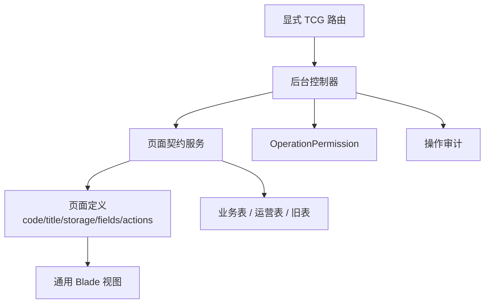

# 后台页面契约架构 Deep Dive

## 1. 解决的问题

TCG 风格后台页面数量多、字段多、动作多。如果每个页面都手写独立控制器、表单、列表和导入导出，开发成本很高。

项目采用页面契约：

- 一个页面 code 对应一个页面定义。
- 页面定义描述标题、模块、存储表、筛选项、列表列、字段、动作、状态字段和日期字段。
- 通用服务负责查询、过滤、保存、状态、删除、导入和导出。
- 通用 Blade 页面负责渲染。

## 2. 契约结构

## 3. 页面类型

平台运营服务支持多种模式：

- settings：写配置。
- records：写通用运营记录。
- legacy：适配旧业务表。
- report：聚合只读报表。
- transactions：写交易型运营记录。

游戏管理服务主要通过页面契约直接映射到游戏、彩票、中奖排行、热门游戏和免费转次数等表。

TCG 运营记录控制器也采用同一类页面契约思想，近期已扩展到积分商城和玩家运营：

- 积分规则、积分调整、商城商品、兑换申请和积分奖励。
- 玩家运营标签、OTP 验证记录、玩家等级历史和前台文案设置。
- 活动黑名单、活动券、活动翻倍规则、玩家限额和用户游戏限制。

平台设置服务使用 tabs 和 fields 管理平台、下载、用户信息、前台样式、APP 打包、APP 下载和 WXGame 配置。

## 4. 显式路由优先

后台路由中，真实 TCG 页面先注册显式路由，最后才注册泛路由。这样可以避免：

- 真实页面被 shell 页面吞掉。
- 页面 code 不可区分。
- 控制器行为测试失效。

这是一个重要的路由设计细节。

## 5. 输入过滤

页面契约服务不直接保存全部请求输入，而是：

- 只接受定义过的字段。
- 对 text / textarea 去标签并截断。
- 对 integer 转整数。
- 对 decimal 转浮点。
- 对 boolean 规范化为 1/0。
- 对 datetime 和 month 做格式控制。
- 对 select 字段从契约选项中渲染。
- 对 status 做规范化。
- 对旧表保存过滤实际存在字段。

这比传统后台直接批量赋值更安全。

## 6. 权限与审计

新后台页面使用 OperationPermission：

- 平台运营读写删导出。
- 游戏管理读写删导出。
- 站点配置更新。
- API 平台更新。
- 活动内容更新。

操作后写审计或操作日志，尤其是配置修改和后台变更。

## 7. 旧表适配

平台运营服务不仅支持新表，也适配旧业务表：

- 游戏厂商从 game_lists 聚合。
- 支付类型适配 pay_types。
- 支付账号适配 pay_setting、code_pay、usdt_pay。
- 佣金政策适配 agent_settlements。
- 帮助中心适配 articles 和 articlescate。
- 银行账号适配 banks 和 pay_setting。

这是一个迁移策略：不先重建数据模型，而是用新后台统一旧表入口。

## 8. 优点

- 新增页面速度快。
- 页面行为可通过 contract 测试固定。
- 输入白名单更安全。
- 导入导出和状态切换可以复用。
- 旧系统迁移成本低。
- 页面级空状态文案、新增按钮文案和编辑按钮文案可以由契约定义，减少通用页面里的硬编码。

## 9. 风险

- 页面 code 变成隐性知识。
- 服务类会越来越大。
- 多模式分支会增加维护成本。
- 契约和数据库 schema 容易漂移。
- 旧表适配逻辑如果没有测试，风险高。
- select 选项、状态枚举和页面文案继续增多后，需要集中维护字典。

## 10. 改进建议

1. 建立页面 code 字典。
2. 按模块拆分页面契约。
3. 为每个页面定义 schema 测试。
4. 为导入导出建立统一格式。
5. 把旧表适配器独立成 adapter 类。
6. 为所有写动作统一审计。
7. 在后台页面展示存储来源，避免运营误解。

## 11. 证据边界

已确认：

- GameManagementService 存在页面契约。
- PlatformOperationsService 存在多模式页面契约。
- PlatformSettingsService 存在 tabs 和 fields。
- TCG 运营记录控制器已接入积分商城、玩家运营、活动风控等专用表契约。
- 通用 TCG 运营 Blade 已支持 select 字段和页面自定义文案。
- Admin routes 显式注册 TCG 页面并最后使用泛路由。
- OperationPermission 存在后台能力权限。

证据不足：

- 所有 TCG shell 页面是否都已接入真实数据。
- 运营人员使用手册。
- 页面 code 的外部来源。
