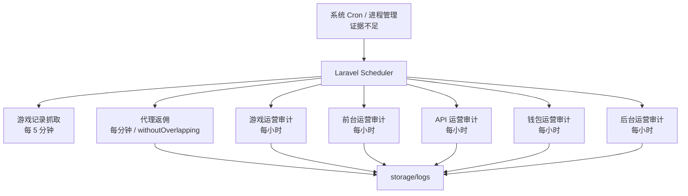

# 异步处理与调度 Deep Dive

## 1. 解决的问题

系统中存在需要定时执行的任务：

- 抓取第三方游戏记录。
- 执行代理返佣。
- 审计游戏、前台、API、钱包和后台状态。

项目当前的异步策略不是复杂消息队列，而是 Laravel Scheduler + 同步队列默认配置。

## 2. 队列配置

队列默认连接为 `sync`。

含义：

- 如果代码 dispatch job，默认会在当前进程同步执行。
- 没有证据显示生产必须运行 queue worker。
- Laravel 仍保留 database、Redis、SQS 等连接配置。

风险：

- 外部 API 调用如果在请求中同步执行，可能增加响应时间。
- 如果未来切换到 Redis queue，需要补 worker 管理和失败任务处理。

## 3. Scheduler 调度

## 4. 游戏记录抓取

每 5 分钟执行。用于同步第三方游戏记录，支撑投注记录、报表、代理统计和对账。

风险：

- 第三方接口失败会导致记录延迟。
- 如果重复抓取缺少幂等，可能产生重复记录。
- 如果抓取窗口配置不合理，可能遗漏记录。

## 5. 代理返佣

每分钟执行，并使用 withoutOverlapping。

这说明任务可能耗时或不允许并发执行。输出追加到代理返佣日志。

风险：

- 锁未释放可能导致任务长期不执行。
- 返佣涉及资金流水，必须具备幂等和对账。
- 返佣周期和层级受系统配置影响。

## 6. 运营审计任务

每小时执行的审计包括：

- 游戏运营审计。
- 前台运营审计。
- API 运营审计。
- 钱包运营审计。
- 后台运营审计。

这些命令体现了项目的质量保障思路：把运营系统的关键状态变成命令化巡检，而不是完全依赖人工。

### 游戏审计

关注游戏目录、第三方游戏数据、平台状态和游戏管理。

### 前台审计

关注前台入口、页面资源、游戏打开参数、客服入口和公共文件。

### API 审计

关注 API 端点覆盖、第三方游戏确认流程和接口语义。

### 钱包审计

关注钱包表、唯一索引、重复订单、schema 和资金链路源码 guard。

### 后台审计

关注后台路由、控制器、只读页面、危险入口和权限标记。

## 7. 运维要求

生产环境必须确保：

- Scheduler 每分钟被触发。
- storage/logs 可写。
- 任务日志可轮转。
- 审计日志有人查看或告警。
- withoutOverlapping 锁不会长期残留。

仓库未提供 crontab 或进程配置，因此部署侧需要补充。

## 8. 改进建议

1. 为 Scheduler 增加健康检查。
2. 为每个命令输出结构化 summary。
3. 将高危审计结果接入告警。
4. 对资金和游戏记录抓取增加幂等测试。
5. 如果切换队列，补充 worker 文档和失败任务处理。
6. 对外部 API 调用增加超时和重试策略文档。

## 9. 证据边界

已确认：

- 队列默认 sync。
- Scheduler 配置存在。
- 游戏记录、代理返佣和多类审计命令存在。
- 部分任务使用 withoutOverlapping。

证据不足：

- 生产 scheduler 触发方式。
- queue worker 是否运行。
- 告警和监控系统。
- 外部 API 重试策略。
