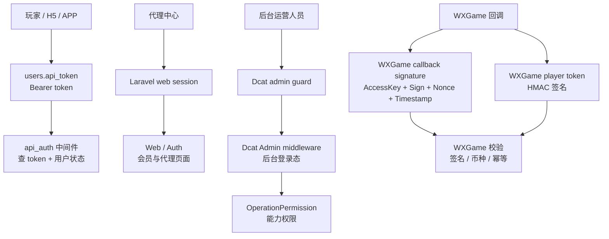

# 认证与权限模型 Deep Dive

## 1. 解决的问题

本系统同时服务玩家、代理、后台运营人员和第三方回调。不同入口的身份模型不同：

- 玩家 API 使用用户表中的 API token。
- Web 会员和代理页面使用 Laravel session / Auth 语义。
- 后台运营使用 Dcat Admin guard。
- 后台高危动作使用 OperationPermission 能力权限。
- WXGame 回调使用玩家 token、回调签名和玩家标识。

该专题解释这些身份边界如何并存，以及风险在哪里。

## 2. 认证模型总览

## 3. 玩家 API token

玩家登录成功后，系统会生成或返回 API token。前端把 token 写入本地存储，并在后续会员、游戏、资金、活动和客服请求中使用。

API 鉴权中间件执行：

1. 从请求中读取 Bearer token。
2. 去掉 Bearer 前缀。
3. 按 `users.api_token` 查找用户。
4. 如果没有用户，返回认证失败。
5. 如果用户禁用、删除或黑名单，返回账号禁用。
6. 把认证用户放入 request attributes。

重要点：

- 鉴权不是只看 token 是否存在，还检查用户状态。
- 黑名单用户在 API 边界被拒绝。
- 这对资金和游戏系统很关键。

风险：

- 前端 token 存在 localStorage / sessionStorage，容易受 XSS 影响。
- 前端兼容多个 token key，注销和清理需要统一。
- 部分旧控制器仍存在手动解析 token 的模式，可能绕过统一中间件约束。

## 4. Web 会员和代理 session

Web 会员中心和代理中心使用 Laravel Web 组能力，包含 session、cookie、CSRF 和路由绑定。

代理中心除了 session 登录外，还依赖用户上下级关系和代理身份规则。代理 API 中也存在 token 或当前用户解析逻辑，用于团队报表、团队充值和下级查询。

代理团队充值是最需要权限保护的代理动作：

- 代理必须通过身份校验。
- 充值目标必须是下级会员。
- 必须提供幂等业务号。
- 事务中扣代理余额、加下级余额、写充值记录和转账流水。

风险：

- 代理页面和 API 跨越 session、token 和上下级权限，需要统一边界文档。
- 团队充值属于资金动作，应始终视为高危接口。

## 5. Dcat Admin 后台认证

后台使用 Dcat Admin：

- 后台 guard 是 `admin`。
- 后台用户模型是 Dcat Admin Administrator。
- 后台权限开关开启。
- 菜单和权限绑定开启。
- 后台路由使用 web + admin middleware。

Dcat Admin 提供基础的后台登录、角色、权限和菜单体系。传统后台资源页主要依赖这套能力。

风险：

- 如果后台权限开关关闭，项目自定义 OperationPermission 会直接放行。
- 后台路径、后台域名和 HTTPS 配置是高敏感配置。

## 6. OperationPermission 能力权限

项目新增 OperationPermission，用常量表达危险动作：

- 财务充值通过 / 拒绝。
- 提现通过 / 拒绝。
- 会员余额调整和恢复。
- 代理佣金结算。
- 活动审核。
- 会员密码重置。
- 会员代理、状态、VIP 更新。
- 游戏列表更新和发布开关。
- API 平台更新和开关。
- 活动内容更新和发布。
- 平台运营读写删导出。
- 游戏管理读写删导出。

这是一个从“菜单权限”向“动作能力权限”演进的迹象。

推荐原则：

- 所有资金写操作必须有能力权限。
- 所有导出必须有能力权限。
- 所有配置修改必须有能力权限。
- 所有开关类操作必须有能力权限。

## 7. WXGame 身份边界

WXGame 有两层保护：

### 玩家 token

后端生成玩家 token，包含用户、游戏品牌、游戏 id 和签名。WXGame 回调校验玩家 token 后，才能识别玩家。

### 回调签名

回调可要求签名校验：

- AccessKeyId 必须匹配。
- Timestamp 必须在配置窗口内。
- Sign 必须匹配。
- Nonce + timestamp + sign 会进入缓存去重，避免重复签名。

此外还会校验币种，防止回调币种与系统配置不一致。

风险：

- 生产环境不应关闭签名校验。
- `wxgame_token_secret` 缺失时会回退到其他密钥，需明确生产策略。
- 缓存去重依赖 Laravel Cache，生产 cache 配置需要稳定。

## 8. 权限风险清单

高风险点：

- API token 本地存储。
- CORS 反射 Origin。
- 旧接口手动解析 token。
- 后台权限开关可关闭。
- 传统资源控制器高危动作未必全部接入 OperationPermission。
- WXGame 签名可通过配置关闭。
- 支付回调和游戏回调必须持续审计。

## 9. 改进建议

1. 统一所有会员 API 到 `api_auth`。
2. 为旧接口建立鉴权例外清单。
3. 把 `api_auth_user` 作为控制器统一用户来源。
4. 高危后台动作全部接入 OperationPermission。
5. 为 token 增加过期、轮换和注销一致性策略。
6. 对 CORS 加白名单，不再无条件反射 Origin。
7. WXGame 生产强制签名校验。
8. 输出后台权限矩阵文档。

## 10. 证据边界

已确认：

- API token 鉴权中间件存在。
- 用户状态、删除、黑名单会被检查。
- Dcat Admin 权限开启。
- OperationPermission 常量存在。
- WXGame token 和回调签名校验存在。

证据不足：

- 生产 token 过期策略。
- 所有传统后台动作是否都接入能力权限。
- 线上 CORS 白名单策略。
- 所有支付回调的完整验签一致性。
