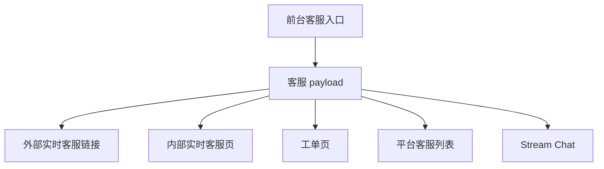
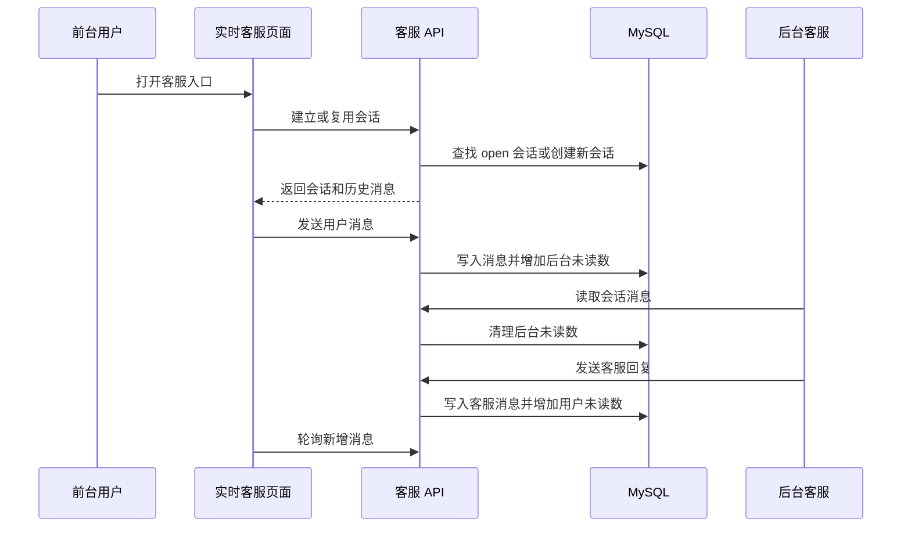

# 客服与内部实时会话 Deep Dive

## 1. 解决的问题

客服链路承担玩家咨询、充值提现异常、活动问题和账户问题处理。代码中同时存在多种客服模式：

- 外部客服链接。
- 平台客服列表。
- Stream Chat。
- 工单系统。
- 内部实时客服会话。

本专题说明这些模式如何组合，以及新增内部实时客服如何改变原来的客服边界。

## 2. 客服入口优先级

运行语义：

- 外部实时客服链接优先。
- 没有外部实时客服时，内部实时客服可以作为实时客服提供方。
- 工单页面作为 fallback 保留。
- 平台客服列表用于展示多个联系方式。
- Stream Chat 仍是独立的第三方聊天配置能力。

关键改动是：工单地址不会再被误当作实时客服链接，内部实时客服和工单 fallback 可以同时存在。

## 3. 内部实时客服数据模型

内部实时客服由两张表承载：

| 表 | 职责 |
|---|---|
| `live_chat_sessions` | 会话编号、访客标识、会员绑定、状态、接待客服、最后消息、用户/后台未读数和关闭时间 |
| `live_chat_messages` | 会话消息、发送方类型、会员或后台用户、内容、已读时间和软删除 |

配置开关来自 `system_config`：

| key | 含义 |
|---|---|
| `internal_live_chat_enabled` | 是否启用内部实时客服 |

迁移还会写入后台菜单，让运营人员可以从 Dcat Admin 打开在线客服页面。

## 4. 前台会话流程

前台身份有两种：

- 游客：通过浏览器本地 visitor id 建立会话。
- 会员：通过 Bearer token 识别账号，并可把匿名会话绑定到会员。

## 5. 后台接待流程

后台在线客服页面提供：

- 会话列表。
- 状态筛选和关键词搜索。
- 消息读取。
- 客服回复。
- 关闭会话。
- 重新打开会话。

后台读取会话时会清理后台未读数，并把用户消息标记为已读。后台回复时会更新最后消息、客服回复时间和用户侧未读数。

## 6. 设计取舍

### 为什么不用纯外链

外部客服链接部署简单，但业务数据留在第三方系统里，后台无法统一查看会话、未读数和运营接待状态。内部实时客服把会话和消息留在本地数据库，适合作为外链不可用或未采购第三方服务时的兜底。

### 为什么允许游客会话

游客在充值前、注册前或登录失败时也可能需要咨询客服。如果实时客服必须登录，会损失前置转化和问题处理能力。因此内部客服允许 visitor id 建会话。

### 为什么仍保留工单

实时客服适合同步沟通，工单适合异步跟进和复杂问题沉淀。两者不是替代关系，而是同步支持与异步支持的组合。

## 7. 风险

- visitor id 不是强身份，不能用于资金、游戏、账户敏感动作。
- 轮询模式简单可靠，但在线用户多时会增加 API 和数据库压力。
- 消息内容需要长度限制、HTML 转义和潜在敏感词治理。
- 后台客服回复依赖 Dcat Admin 登录态，但仍需要确认是否需要更细的接待权限。
- 表未迁移或开关未开启时，前台会进入不可用状态，需要清晰 fallback。

## 8. 运维检查

上线或配置变更后建议检查：

1. `internal_live_chat_enabled` 是否符合预期。
2. 两张实时客服表是否存在。
3. 前台客服 payload 是否返回正确 provider。
4. 游客可以建立会话并发送消息。
5. 登录会员可以复用或绑定会话。
6. 后台客服可以看到未读数、读取消息并回复。
7. 工单 fallback 仍可打开。

## 9. 改进建议

1. 为实时客服接口增加 IP 或 visitor id 维度限流。
2. 为后台接待增加独立能力权限。
3. 为会话分配、转接和客服在线状态建模。
4. 为消息内容增加审计、敏感词和垃圾消息治理。
5. 将轮询间隔、最大消息长度和会话保留期纳入配置字典。

## 10. 证据边界

已确认：

- 内部实时客服迁移存在。
- 前台实时客服页面存在。
- 前台 API 支持建会话、拉消息、发消息和关闭会话。
- 后台控制器支持会话列表、消息读取、回复、关闭和重开。
- 客服 payload 区分外部实时客服、内部实时客服和工单 fallback。
- 已有测试覆盖内部实时客服优先级和游客建会话发消息。

证据不足：

- 生产是否已经开启内部实时客服。
- 后台客服排班、转接和 SLA 规则。
- 消息数据保留周期。
- 线上限流和反滥用策略。
