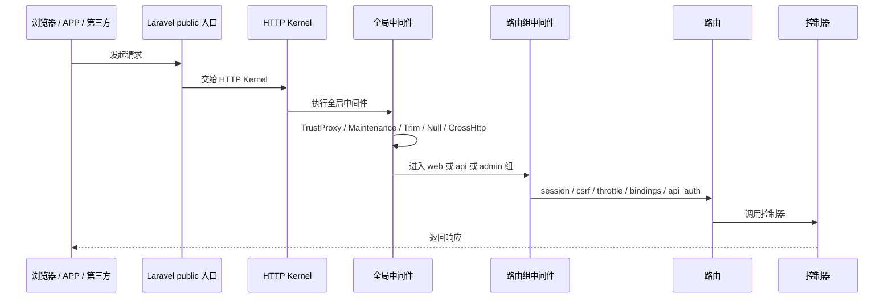

# 中间件链 Deep Dive

## 1. 解决的问题

Laravel 单体应用同时承载 Web、API、Admin、代理和回调入口。中间件链决定：

- 请求如何跨域。
- 语言如何选择。
- Session 和 CSRF 是否启用。
- API 是否需要 token。
- 用户活动是否记录。
- 后台是否进入 Dcat Admin 权限体系。

## 2. HTTP 请求链路

## 3. 全局中间件

全局中间件包含 Laravel 标准能力和项目自定义 CrossHttp。

CrossHttp 承担两个职责：

1. 从请求头读取语言并设置 Laravel locale。
2. 设置 CORS 响应头。

### 语言

请求头 `Lang` 会影响后端 locale。基础控制器返回业务错误码时，也会根据 Lang 选择错误文案。

风险：

- 前端使用 `zh-CN`，后端默认 `zh_CN` 或 `zh`，多语言 key 需要统一。

### CORS

CrossHttp 会取请求 Origin，存在时把该 Origin 设置为允许来源，否则使用 `*`。如果 Origin 不是 `*`，会允许 credentials。

优势：

- 兼容多域名前台、代理域名、H5、APP WebView。

风险：

- 反射 Origin 的策略对资金系统偏宽松。
- 如果配合本地存储 token 和 XSS 风险，攻击面会上升。

建议：

- 使用 `safe_domain` 或专门配置做 CORS 白名单。
- 对后台路径和高危回调路径不要使用宽松 CORS。

## 4. Web 中间件组

Web 组包含：

- Cookie 加密。
- Cookie 入队。
- Session 启动。
- View 共享错误。
- CSRF 校验。
- 路由绑定。
- 用户活动记录。

适用入口：

- 桌面页面。
- 手机页面。
- 会员 Web 页面。
- 代理中心。
- 支付回调中的部分 Web 路由。
- Dcat Admin。

Web 组适合需要 session 和表单的页面。

## 5. API 中间件组

API 组包含：

- 高阈值 throttle。
- 路由绑定。
- CORS / locale。
- 用户活动记录。

需要登录的 API 再叠加 `api_auth`。

适用入口：

- 前台 H5 / APP JSON 请求。
- 活动列表和活动申请。
- 游戏启动。
- 充值提现。
- 工单。
- 内部实时客服会话、消息轮询、消息发送和关闭。
- 代理团队 API。
- WXGame 和支付部分回调。

注意：

- 公开 API 和登录 API 不加 `api_auth`。
- 会员资金、游戏启动、活动申请和工单接口应加 `api_auth`。
- 内部实时客服是特殊公开入口：游客通过 visitor id 进入，登录会员可额外携带 token 绑定会话，因此不能简单归入全部必须 `api_auth` 的会员接口。

## 6. Admin 中间件

后台路由使用 Dcat Admin 配置：

- web middleware。
- admin middleware。

后台请求链路：

1. Web session。
2. Dcat Admin 登录态。
3. Dcat Admin 权限体系。
4. 项目自定义 OperationPermission。
5. 控制器和服务。

后台 TCG 页面还强调显式路由优先，泛路由最后兜底，避免真实页面被 shell 吞掉。

在线客服后台页也走 Dcat Admin 中间件。后台读取和回复实时客服会话依赖 admin session，和前台 visitor id 会话入口是两个不同安全边界。

## 7. 回调入口

回调入口较特殊：

- 支付回调通常不依赖用户 session。
- WXGame 回调不依赖玩家 API token，而依赖 player token、回调签名、币种和交易幂等。
- 部分回调存在多套兼容路径。

风险：

- 回调路径不能简单套玩家 API 鉴权。
- 必须有独立验签和幂等。

## 8. 改进建议

1. 为 API 路由标注公开、登录、回调、兼容四类。
2. 把需要登录的所有会员接口统一放入 `api_auth`。
3. 把 CORS 改为白名单模式。
4. 对回调入口建立独立 middleware 或 guard。
5. 为内部实时客服标注“公开但受 visitor id 和配置开关约束”的单独类别。
6. 将语言头规范统一为一套内部 locale。
7. 为 Dcat Admin 高危动作统一接 OperationPermission。

## 9. 证据边界

已确认：

- CrossHttp 全局中间件存在。
- API 组和 Web 组存在。
- api_auth 中间件存在。
- Dcat Admin 后台中间件存在。
- 内部实时客服前台入口位于 API 组，后台接待入口位于 Dcat Admin 路由组。

证据不足：

- 生产环境前置 Web server 是否还有额外 CORS、WAF 或限流。
- 所有旧接口是否已正确归类。
