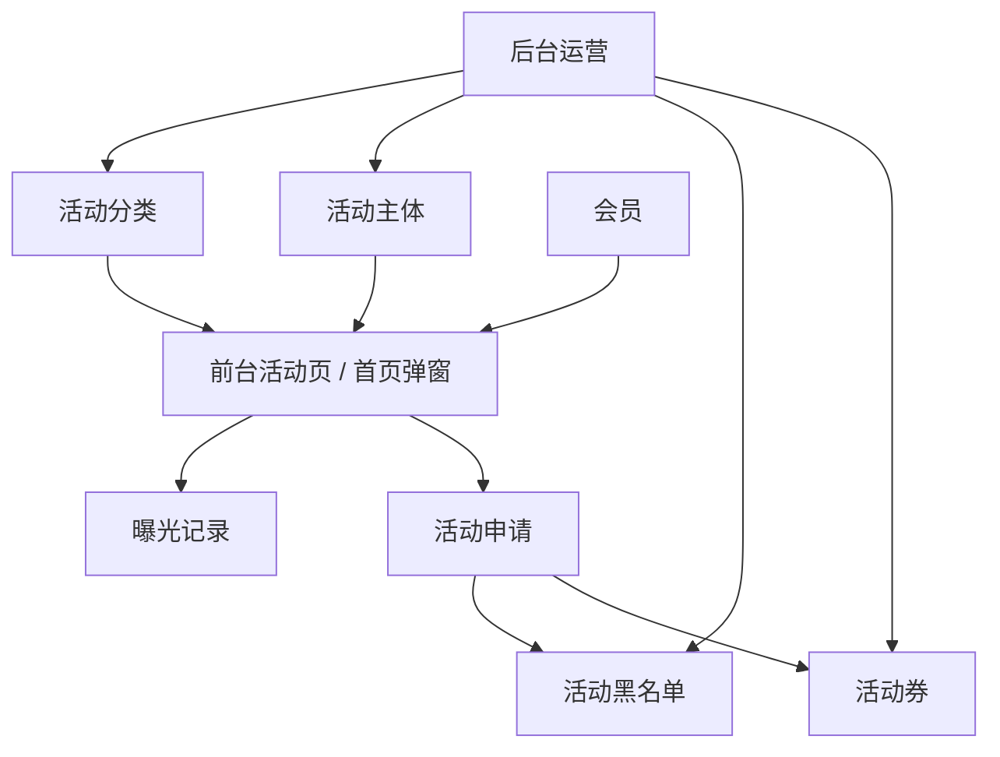

# 活动与运营工作流 Deep Dive

## 1. 解决的问题

活动系统承担拉新、留存、充值转化和会员激励。它不只是前台 Banner，而是包含：

- 分类。
- 列表。
- 详情。
- 首页弹窗。
- 曝光记录。
- 申请。
- 黑名单。
- 活动券。
- 后台内容配置。
- 前端旧路径兼容。

## 2. 活动数据流

## 3. 活动展示规则

活动服务负责可见性：

- 活动 state 必须启用。
- 移动端访问时 app_state 必须启用。
- 当前时间必须在开始和结束时间之间。
- 可见活动按 sort_order 和 id 排序。

这个边界设计较好，因为它把展示规则独立出来，不掺杂用户申请、券和曝光。

## 4. 弹窗机制

前台活动脚本会请求首页弹窗活动，并根据活动配置控制展示：

- once：同一活动只弹一次。
- daily：每天弹一次。
- always：总是弹。
- 其他频率：按 session 控制。
- 支持 delay 秒数。
- 支持预览或强制弹窗参数。

弹窗展示后会：

- 标记本地存储。
- 记录曝光。
- 点击后跳转活动详情。

产品价值：

- 控制运营触达频率。
- 记录活动曝光。
- 支持首页转化。

## 5. 活动申请流程

活动申请逻辑涉及：

1. 会员登录校验。
2. 活动存在性。
3. 活动可见性。
4. 活动是否允许申请。
5. 是否重复申请。
6. 是否命中活动黑名单。
7. 活动券是否有效。
8. 创建申请记录。
9. 活动券标记已使用。

这说明活动申请已经有风控闭环，而不是简单提交表单。

## 6. 黑名单与活动券

TCG 业务运营服务提供：

- 活动黑名单命中。
- 黑名单原因或备注提示。
- 活动券查询。
- 活动券使用标记。

匹配维度包括：

- 用户 id。
- 用户名。
- 活动 id。
- 生效时间。
- 失效时间。
- 状态。

优点：

- 运营可对特定用户或活动加限制。
- 活动券支持指定用户或通用券。
- 服务在表不存在时降级，便于增量上线。

风险：

- 表不存在时静默降级可能让运营误以为规则生效。
- 活动券并发使用需要靠状态更新和数据库约束保护。

## 7. 前台路径兼容

前端活动脚本支持将旧活动路径统一导向 promotions 语义页。申请时如果新 promotions 申请失败，还会回退到旧活动申请语义。

这说明活动系统正从旧接口迁移到新接口，但需要继续保护旧链接和旧客户端。

## 8. 后台运营

后台活动能力包括：

- 活动资源管理。
- 活动分类管理。
- 活动申请管理。
- 活动内容更新权限。
- 活动发布开关权限。
- TCG 运营记录。
- 活动黑名单、活动券、翻倍规则等业务运营表。

后台需要关注：

- 活动展示状态。
- 移动端状态。
- 图片素材。
- 详情图。
- 弹窗图。
- 操作按钮文案。
- 跳转链接。
- 是否需要登录。
- 是否允许申请。

## 9. 风险

- 活动有旧接口和新接口并存。
- 前台本地弹窗频率控制不能替代服务端曝光策略。
- 活动券并发和重复申请需要数据库约束配合。
- 活动黑名单表不存在时会降级。
- 活动素材和多语言文案需要统一管理。

## 10. 改进建议

1. 为活动建立状态机：草稿、上线、下线、过期。
2. 为活动申请建立明确状态：待审核、通过、拒绝、已发放。
3. 活动券使用增加唯一约束和事务测试。
4. 曝光记录按来源和 session 形成统计报表。
5. 标注旧活动接口为兼容入口。
6. 后台活动表单增加配置预览。
7. 为弹窗策略建立服务端兜底，避免仅依赖浏览器本地存储。

## 11. 证据边界

已确认：

- 活动服务存在。
- 前台活动脚本存在。
- 活动分类、列表、详情、弹窗、曝光、申请存在。
- 活动黑名单和活动券服务存在。
- 后台活动资源和活动权限存在。

证据不足：

- 线上活动数据。
- 活动申请审核发放完整流程。
- 活动转化报表。
