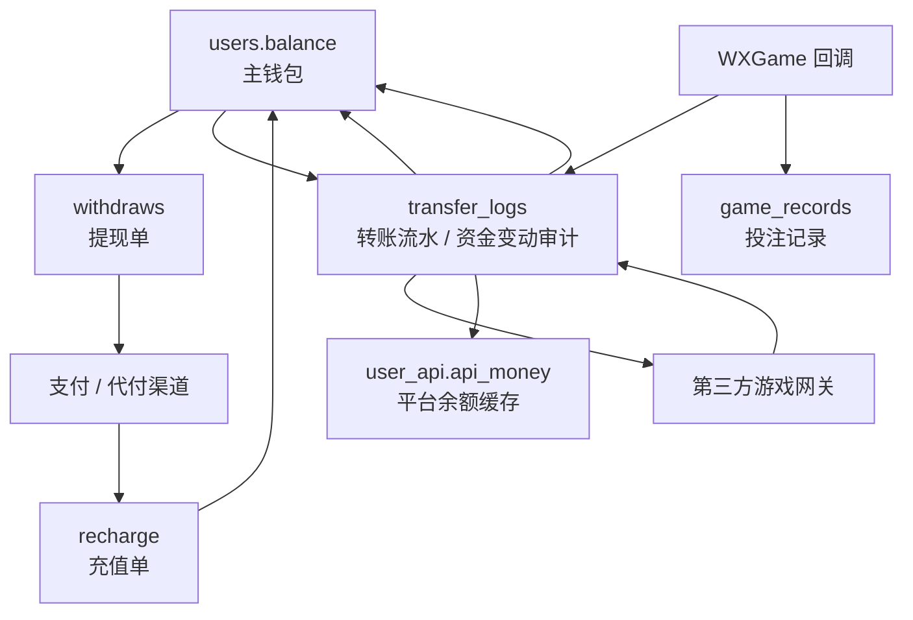

# 钱包与游戏转账一致性 Deep Dive

## 1. 解决的问题

本系统的资金链路围绕主钱包余额展开：

- 会员充值增加主钱包。
- 提现预扣或扣减主钱包。
- 进入第三方游戏时可能把主钱包余额转入游戏平台。
- 离开游戏平台或一键回收时把平台余额转回主钱包。
- WXGame 下注直接扣主钱包。
- WXGame 派奖和退款增加主钱包。
- 代理团队充值同时扣代理余额、加下级余额。

这类系统最关键的问题不是“如何加减余额”，而是：

- 外部系统成功但本地失败怎么办。
- 本地成功但外部失败怎么办。
- 重复请求或重复回调怎么办。
- 并发请求会不会重复扣款。
- 后续如何对账和恢复。

## 2. 资金数据模型

## 3. 主钱包到游戏平台

安全转账服务的转入思路：

1. 检查平台和金额。
2. 检查玩家限额。
3. 在事务中查找同方向 active pending 转账。
4. 锁定用户行。
5. 判断余额是否足够。
6. 扣减主钱包。
7. 创建 pending 转账流水。
8. 调用第三方 deposit。
9. 如果第三方失败，事务中回补余额并标记外部失败。
10. 如果第三方成功，标记成功并更新平台余额缓存。
11. 如果本地后处理异常，标记为外部成功、本地待恢复。

关键设计：

- 先本地预扣，避免外部成功后本地余额不足或并发重复使用。
- 外部调用不包在数据库事务内部长期持锁。
- 外部成功但本地失败是显式状态，而不是简单异常。

## 4. 游戏平台到主钱包

转出思路：

1. 检查平台和金额。
2. 在事务中检查同方向 active pending。
3. 锁定用户。
4. 创建 pending 转账流水，但不先增加主钱包。
5. 调用第三方 withdrawal。
6. 外部失败则标记失败，不增加主钱包。
7. 外部成功后再锁定用户并增加主钱包。
8. 更新平台余额缓存。

关键设计：

- 外部未确认前不增加本地余额。
- 防止玩家拿到本地余额但外部未扣款。

## 5. 自动转账

进入游戏时，服务会尝试：

1. 查询上一次成功转入的平台。
2. 如果上一次平台和目标平台不同，先查上一个平台余额。
3. 如果余额达到最小转出金额，先回收到主钱包。
4. 再把当前主钱包余额转入目标平台。

产品意义：

- 玩家切换游戏时减少手动回收。
- 主钱包和游戏平台之间保持相对清晰的当前平台余额关系。

风险：

- 上一个平台余额查询失败会阻止自动切换。
- 如果第三方平台余额不同步，需要人工对账。

## 6. WXGame 下注、派奖、退款

WXGame 不走传统平台转入转出模式，而是通过回调直接影响主钱包。

### 下注

流程：

1. 校验回调签名。
2. 校验币种。
3. 查找玩家。
4. 检查交易 id 是否已存在。
5. 检查游戏限制和玩家限额。
6. 锁定用户。
7. 再次检查交易 id。
8. 检查余额是否足够。
9. 扣减余额。
10. 写转账流水。
11. 写游戏记录。

### 派奖

流程：

1. 校验签名和币种。
2. 查找玩家。
3. 检查交易 id 幂等。
4. 可选校验关联下注。
5. 锁定用户。
6. 增加余额。
7. 写转账流水。
8. 写游戏记录。

### 退款

流程：

1. 校验签名和币种。
2. 查找玩家。
3. 检查交易 id 幂等。
4. 校验关联下注。
5. 锁定用户。
6. 回补余额。
7. 写退款流水。

关键点：

- transaction id 是幂等核心。
- 用户行锁用于保护余额。
- 关联下注校验用于防止孤立派奖或退款。

## 7. 代理团队充值

代理团队充值采用另一条资金一致性链路：

1. 校验代理身份。
2. 校验目标下级。
3. 校验金额。
4. 校验 client_order_no。
5. 生成稳定 out_trade_no。
6. 事务中锁定代理和下级。
7. 如果已有相同订单，返回 duplicate 或冲突。
8. 扣减代理余额。
9. 增加下级余额。
10. 创建充值记录。
11. 写代理扣款流水。
12. 写下级入账流水。
13. 写代理操作日志。

这是一个较成熟的内部资金操作模式。

## 8. 状态与对账

转账流水中可见的重要状态语义：

- `state`：业务成功、失败或处理中。
- `external_status`：外部调用状态。
- `recovery_status`：恢复状态。
- `posted_at`：本地落账时间。
- `reconcile_note`：对账备注。

最重要的异常状态：

- 外部失败，本地回补。
- 外部成功，本地待恢复。
- 转账处理中。

运维应重点监控：

- 长时间 pending。
- external_success_local_pending。
- 重复订单。
- 提现拒绝但余额未回滚。
- WXGame 重复交易 id。

## 9. 风险

- 旧控制器中仍有不可达或旧转账逻辑，会干扰维护。
- 并非所有资金入口都已达到安全转账服务同等级别。
- 缺少完整的恢复后台和自动对账任务证据。
- 真实第三方失败码和重试策略证据不足。
- 队列默认 sync，长时间外部调用可能影响请求耗时。

## 10. 改进建议

1. 把所有资金动作统一归档到资金服务层。
2. 为转账流水增加后台待恢复列表。
3. 补充自动对账命令。
4. 对充值、提现、代理充值、返水、红包建立统一幂等模型。
5. 对 WXGame 回调补充集成测试。
6. 清理新 return 后的不可达旧逻辑。
7. 为所有资金表建立唯一订单索引和重复提交测试。

## 11. 证据边界

已确认：

- 安全转账服务存在。
- 转账流水 recovery 字段存在。
- WXGame 回调幂等和行锁存在。
- 代理团队充值幂等存在。
- 钱包审计命令存在。

证据不足：

- 生产对账后台。
- 第三方游戏平台真实失败码。
- 资金恢复 SOP。
- 所有支付通道的完整验签策略。
