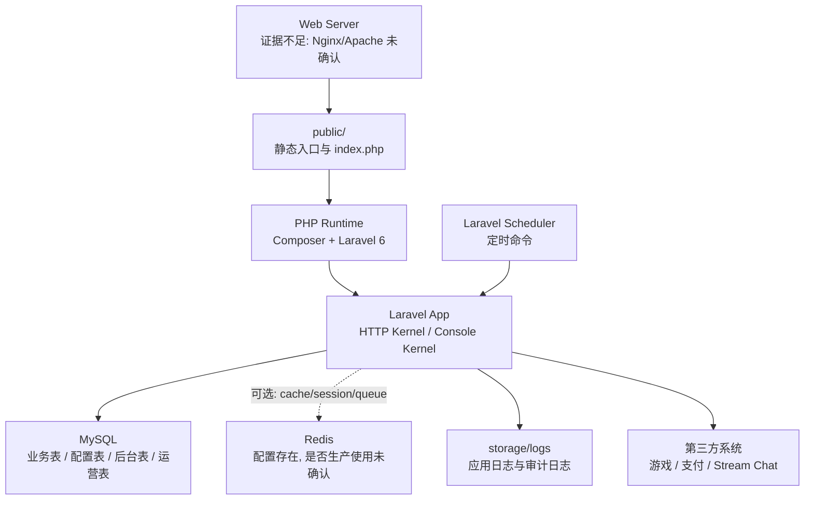

# TH2W / TH2.VIP 部署与运维指南

## 1. 文档定位

本文基于仓库可见证据整理应用级部署和运维要点。仓库没有 Dockerfile、docker-compose、Kubernetes、Helm、GitHub Actions、GitLab CI 或 Web 服务器配置，因此本文不会编造完整生产拓扑。

已确认：

- 项目是 Laravel 6 应用。
- 依赖通过 Composer 管理。
- 默认数据库是 MySQL。
- 队列默认 sync。
- 定时任务通过 Laravel Scheduler。
- 日志使用 Laravel daily 日志，并有多个专项审计日志。
- 前台静态资源位于 public 目录。
- 后台使用 Dcat Admin。

证据不足：

- 生产 Web 服务器是 Nginx、Apache 还是其他。
- PHP-FPM 版本和进程管理方式。
- 是否使用 Supervisor、systemd、宝塔、面板或容器。
- CI/CD 和自动发布流程。
- 线上备份、监控、告警和回滚策略。

## 2. 运行组件

## 3. 基础依赖

### PHP

Composer 要求 PHP `^7.2`。项目使用 Laravel 6 和 Dcat Admin 2。

注意：

- Laravel 6 对 PHP 版本兼容较旧。
- 如果生产环境升级 PHP，需要先验证 Dcat Admin、二维码包、老代码中的动态属性、旧语法和依赖兼容性。

### Composer

依赖来源：

- Laravel Framework。
- Dcat Admin。
- 登录验证码扩展。
- Laravel tinker。
- QR Code 包。
- PHPUnit、Mockery、Whoops 等开发依赖。

部署时建议：

- 生产安装不包含 dev 依赖。
- 使用优化 autoloader。
- 确认 `composer.lock` 与生产安装一致。

### 数据库

默认数据库为 MySQL，字符集 `utf8mb4`，collation `utf8mb4_unicode_ci`，strict 模式开启。

数据库承载：

- 会员、钱包、充值、提现。
- 游戏平台、游戏列表、投注记录。
- 活动、分类、申请、曝光。
- 代理、佣金、团队关系。
- 工单、消息、公告。
- Dcat Admin 用户、权限、菜单。
- TCG 平台设置、游戏管理、KYC、推广和运营记录。
- `system_config` 运行时配置。

### Redis

配置文件保留 Redis 配置，但当前证据不足以确认生产是否使用 Redis。Redis 可能用于 cache、session 或 queue，也可能未启用。

### 队列

默认 queue connection 是 `sync`。这意味着任务通常在请求或命令进程内同步执行。

如果生产改用 Redis 或 database queue，需要补充：

- queue worker 启动方式。
- worker 数量。
- retry 策略。
- failed job 处理。
- 部署时 worker 平滑重启。

仓库内未见这些配置证据。

## 4. 应用入口

### HTTP 入口

Laravel 入口位于 public 下。Web 服务器应把站点根目录指向 public，而不是项目根目录。

HTTP 请求进入：

1. public 入口。
2. Laravel HTTP Kernel。
3. 全局中间件。
4. Web、API 或 Admin 路由。
5. 控制器、服务、数据库和第三方系统。

### Console 入口

Artisan 入口用于：

- 执行迁移。
- 清理缓存。
- 运行调度器。
- 执行审计命令。
- 抓取游戏记录。
- 执行代理返佣。

## 5. 发布前检查

### 代码和依赖

建议检查：

- `composer install` 成功。
- autoload 生成成功。
- Laravel package discovery 成功。
- PHP 扩展满足项目需求：PDO MySQL、curl、mbstring、openssl、json、fileinfo 等。
- public 目录可由 Web 服务器访问。
- storage 和 bootstrap cache 可写。

### 环境变量

发布前至少确认：

- `APP_ENV` 是正确环境。
- `APP_DEBUG` 生产关闭。
- `APP_KEY` 已设置。
- `APP_URL` 是正确公开地址。
- 数据库连接正确。
- 后台域名和后台路径正确。
- 前台 PC、WAP、代理域名配置正确。
- 日志通道可写。

### 数据库

发布前至少确认：

- 数据库备份已完成。
- 迁移列表确认。
- 高风险迁移已经在测试环境执行。
- `system_config` 关键配置存在。
- 后台 admin 表存在。
- TCG 新增表存在。

### 第三方系统

发布前至少确认：

- 游戏网关地址、商户号、密钥正确。
- WXGame 启用时 API 域名、AccessKey、回调域名、币种和签名配置完整。
- 支付商户配置正确。
- 客服链接、工单或 Stream Chat 配置可用。

## 6. 迁移策略

项目迁移存在明显的生产兼容倾向：

- 创建表前检查表是否存在。
- 增加字段前检查字段是否存在。
- 服务在表不存在时可能降级。
- 部分旧业务表被新后台服务适配。

发布建议：

1. 先备份数据库。
2. 在测试库执行迁移。
3. 对比迁移前后表结构。
4. 在生产低峰期执行。
5. 执行后运行关键 smoke check。

高风险迁移类别：

- 钱包和转账流水字段。
- 唯一订单索引。
- 充值、提现和支付表字段。
- 活动申请唯一约束。
- TCG 业务运营表。
- 后台菜单和权限迁移。

## 7. 定时任务

Console Kernel 中调度了以下任务：

| 任务 | 频率 | 作用 |
|---|---|---|
| 游戏记录抓取 | 每 5 分钟 | 拉取或同步第三方游戏记录 |
| 代理返佣 | 每分钟 | 执行代理返佣，禁止重叠 |
| 游戏运营审计 | 每小时 | 检查游戏目录、平台和相关状态 |
| 前台运营审计 | 每小时 | 检查前台入口、资源和公共页面 |
| API 运营审计 | 每小时 | 检查 API 和第三方游戏确认流程 |
| 钱包运营审计 | 每小时 | 检查钱包表、订单、schema 和资金 guard |
| 后台运营审计 | 每小时 | 检查后台路由、权限和危险入口 |

运行要求：

- 生产环境必须有一个进程每分钟触发 Laravel Scheduler。
- 需要确保同一环境不要启动多个重复 scheduler，除非任务本身都带有防重叠保护。
- 代理返佣和审计任务会追加日志到 storage/logs。

证据不足：

- 仓库中没有 crontab、systemd timer 或 Supervisor 配置。

## 8. 日志与审计

### Laravel 日志

默认 daily 日志，保留 14 天。

### 专项日志

调度器会输出：

- 代理返佣日志。
- 游戏运营审计日志。
- 前台运营审计日志。
- API 运营审计日志。
- 钱包运营审计日志。
- 后台运营审计日志。

### 业务审计

后台和业务操作会写入：

- 用户操作日志。
- 后台配置变更审计。
- 代理操作日志。
- 转账流水 reconcile note。
- TCG 运营记录。

运维建议：

- 对资金相关日志设置更长保留期。
- 监控 `external_success_local_pending` 这类待恢复状态。
- 对支付回调失败、WXGame 签名失败、重复回调、提现拒绝和后台高危配置变更设置告警。

## 9. 备份与恢复

必须备份：

- MySQL 全库。
- public 上传文件。
- storage 上传或日志中需要保留的文件。
- `.env` 或等价配置。
- Dcat Admin 上传目录。

高优先级表：

- 用户表。
- 充值表。
- 提现表。
- 转账流水表。
- 游戏记录表。
- 用户游戏平台账号表。
- 系统配置表。
- 后台用户、角色、权限和菜单表。
- 活动、活动申请和曝光表。
- TCG 业务运营表。

恢复后验证：

- 后台可登录。
- 用户可登录。
- 余额显示正确。
- 充值和提现记录可查。
- 游戏列表可加载。
- 活动列表可加载。
- 客服入口可加载。
- Scheduler 可以运行。

## 10. 上线 smoke check

建议每次发布后执行以下检查：

### 前台

- 打开桌面首页。
- 打开手机入口。
- 切换语言。
- 打开活动列表。
- 打开活动详情。
- 检查首页弹窗是否符合配置。
- 打开公告。
- 打开客服入口。

### 会员

- 注册测试会员或登录测试会员。
- 查看会员中心。
- 查询余额。
- 查询充值记录、提现记录和转账记录。
- 创建工单。

### 游戏

- 加载游戏目录。
- 启动一个测试游戏。
- 检查游戏平台状态。
- 如果 WXGame 启用，检查 WXGame 状态和测试回调。

### 资金

- 查询充值通道。
- 创建一笔测试充值订单。
- 提交一笔测试提现到审核前状态。
- 执行小额游戏转入和转出。
- 检查转账流水状态。

### 后台

- 登录后台。
- 打开传统资源页。
- 打开 TCG 平台设置。
- 打开平台运营页面。
- 打开游戏管理页面。
- 测试只读用户是否无法执行写操作。
- 检查操作审计。

### 定时任务

- 手动运行或观察 Scheduler。
- 检查专项审计日志是否追加。
- 检查代理返佣日志是否异常。

## 11. 常见故障定位

### 首页打不开

优先检查：

- Web 服务器是否指向 public。
- PHP 运行是否正常。
- `APP_KEY` 是否存在。
- storage 和 bootstrap cache 是否可写。
- Laravel 日志错误。

### API 返回鉴权失败

优先检查：

- 前端 token 是否存在。
- token 是否对应用户表。
- 用户是否被禁用、删除或黑名单。
- 接口是否需要 API 鉴权。

### 游戏启动失败

优先检查：

- 游戏平台是否启用。
- 游戏是否启用且当前终端可见。
- 用户状态是否正常。
- 是否命中 TCG 游戏限制。
- 游戏网关配置是否完整。
- WXGame 是否启用且配置完整。
- 转账流水是否出现待恢复状态。

### 充值失败

优先检查：

- 充值金额上下限。
- 支付通道状态。
- 支付商户配置。
- 支付回调日志。
- 充值单状态。

### 提现失败

优先检查：

- 提现时间窗口。
- 每日提现次数。
- 最低/最高提现金额。
- 用户余额。
- 打码量。
- 收款账户。
- 取款密码。
- 提现单状态。

### 后台页面打不开

优先检查：

- 后台路径和域名。
- admin session。
- Dcat Admin 权限。
- TCG 显式路由是否被泛路由覆盖。
- 对应业务表是否存在。

### Scheduler 未执行

优先检查：

- 系统是否每分钟触发 Laravel Scheduler。
- PHP CLI 是否使用正确项目和环境变量。
- storage/logs 是否可写。
- 任务是否因为 withoutOverlapping 卡住。

## 12. 安全运维要点

- 生产必须关闭 debug。
- 后台路径和域名属于敏感配置。
- API token 存在前端本地存储，应强化 XSS 防护。
- CORS 当前会反射 Origin，需要结合安全域名策略审计。
- 支付回调和 WXGame 回调必须验签和幂等。
- 游戏、支付和 Stream Chat 密钥必须脱敏展示和审计。
- 高危后台操作必须经过能力权限检查。
- 上传目录必须限制可执行脚本。

## 13. 证据边界

本文基于以下证据：

- Composer 依赖。
- Laravel 配置文件。
- Dcat Admin 配置。
- Console Kernel 调度。
- 日志配置。
- 系统配置模型。
- 后台站点设置表单。
- 游戏服务、支付服务和客服配置读取。
- public 前台入口。

未确认：

- 生产服务器类型。
- Web 服务器配置。
- PHP-FPM 配置。
- CI/CD。
- 容器化或云服务。
- 监控和告警系统。
